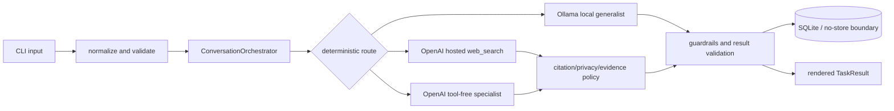

# Project Context

**Project:** Elly Research Assistant (local-first personal AI assistant prototype)
**Purpose:** reusable AI-agent and engineer handoff; this snapshot does not replace the specifications.
**Generated:** 2026-08-15
**Branch:** `main`
**Commit represented:** `2e97406fbaad8d8fd005cc27800dee5133b64403`
**Working tree:** contains the uncommitted V2.5 implementation changes; inspect `git status` before handoff.
**Repository instructions:** no repository-level `AGENTS.md` or `CONTRIBUTING.md` was found.

Important requirements and decisions must be checked against the authoritative files linked below. This document can become stale after repository changes.

## 1. How a New AI Agent Should Use This Document

This is an orientation and handoff document. It summarizes the project and points to authoritative source files; it does not approve requirements or close milestones.

Protocol: locate the relevant section here; follow its link to the authoritative file; inspect directly affected source and tests for implementation questions; distinguish intention from current behavior; state uncertainty; never claim verification without evidence.

Use approved/recorded requirements and owner decisions, frozen contracts, design and acceptance tests, milestone plans and verification reports, implementation guides, README, then source/tests and historical status notes. The actual behavior is determined by source and executable evidence; older completion claims do not override the current independent verification record. Unresolved decisions must not be silently decided.

## 2. Executive Summary

Elly is a single-user, terminal-first, local-first assistant. Ordinary conversation uses a local Ollama generalist. When the owner explicitly permits cloud mode, current-information research and selected coding/research-specialist tasks may use OpenAI-hosted adapters subject to application-owned routing, privacy classification, consent, limits, cost reservations, and redacted audit records.

**Implemented:** the V1 baseline, V1.5 reliability work, all nine V2 requirements,
and all seven V2.5 registry-driven routing requirements.
**Tested:** the final V2.5 run records 368 tests passed; Ruff, strict MyPy across
93 source files, compilation, migration coverage, static boundaries, and
`git diff --check` passed.
**Verified:** all deterministic V2.5 blockers and acceptance criteria are
closed. Limited live-provider quality verification is explicitly deferred
rather than claimed as passing.
**Owner reviewed:** the owner marked V2.5 completed and closed on 2026-08-15;
see [V2_5_CLOSURE.md](v2.5/V2_5_CLOSURE.md).
**Iteration status:** **V2.5 closed with an accepted live-provider verification
boundary.** Historical V1 release gaps remain separate.

## 3. Project Goals and Motivation

**Approved goal:** provide a useful private personal assistant without making cloud access, model output, tools, or external actions authoritative. The owner is the primary user on one trusted personal computer. The core value is visible routing, evidence state, uncertainty, privacy control, bounded resource use, and replaceable providers.

**Documented motivation:** bridge hosted-assistant convenience and the owner’s need for local control, extensibility, current-information research, citations, and explicit abstention. See [REQUIREMENT.md](v1/REQUIREMENT.md) and [DESIGN.md](v1/DESIGN.md). This is not a new product commitment.

## 4. Version 1 Scope

### Included in Version 1

- Text CLI and bounded multi-turn local conversation (UC-01, FR-001/002).
- Local Ollama generalist through `GeneralistPort`, with explicit provider/model configuration (AI-001, API-001).
- Freshness-aware research and hosted OpenAI `web_search` with validated citation metadata (UC-02, FR-003/004, API-003, DEC-OQ-07).
- Evidence selection, conflict/absence handling, injection quarantine, URL safety, and epistemic status (AI-009/010/011/012, SEC-003/006).
- Coding and research specialists through validated TOML manifests and one tool-free Structured Outputs adapter (UC-03/12, AI-003/004/005/007/008/013/015, API-002).
- Cloud mode, privacy classification, exact one-use consent bound to payload and call metadata, and restricted/unclassified fail-closed behavior (UC-04, AI-014, SEC-001/002/004).
- Application-owned limits, retries, timeout, circuit, cancellation, interruption, concurrency, and cost reservations (UC-07/08, NFR-001/002, AI-019, OPS-003/004).
- SQLite sessions, retention, no-store message bodies, confirmed profile items, source metadata, redacted traces, backup/restore prototype, and startup maintenance.
- `/status`, `/new`, `/mode`, `/cancel`, `/approve`, `/deny`, profile/history/trace/source/backup/restore operations.
- EVAL-001…030 catalog and deterministic release-gate harness (NFR-004, AT-15).

### Excluded, Deferred, or Intentionally Unavailable

- **Owner-approved later version:** UC-04 privacy/consent, UC-06 startup continuity, UC-09 profile/session controls, and UC-11 trace/audit review are not current-release verified; see [M7_UAT_RECORD.md](v1/M7_UAT_RECORD.md) and DEC-M7-03 in [DECISIONS.md](v1/DECISIONS.md).
- **Deferred:** local page reading, full page-body RAG, semantic/vector memory, web UI, portable trace export, voice, vision, crawling, computer control, fine-tuning, parallel/recursive specialist graphs, finance-specialist execution, and autonomous tools.
- **Unavailable by design:** high-impact/write actions, specialist shell/file/tool execution, model-authorized external actions, silent cloud fallback, and treating URL metadata alone as `known` claim support.
- **Unresolved/release-blocking:** authoritative provider pricing, vetted production backup AEAD/key management, recovery acceptance, complete aggregate quality corpus, and final threshold review.
- At the V1/V1.5 baseline, `stock_analysis` had a validated manifest but was not
  conversationally selectable; V2.5 replaces that limitation with registry-
  driven catalog selection.

The reopened milestone gaps are intentionally deferred to later project iterations; see [DEFERRED_MILESTONE_GAPS.md](DEFERRED_MILESTONE_GAPS.md). That record does not close or change milestone status by itself.

### Version 1.5 scope and status

V1.5 is an incremental architecture and reliability release built on V1. It preserves the modular monolith, CLI, local Ollama path, SQLite, and existing privacy/security boundaries while adding:

- thinner workflow coordination with explicit routing, local-conversation, context, authorization, execution, and capability collaborators;
- typed optional capability descriptors, availability states, handlers, and registry dispatch;
- deterministic route decisions with public reason codes and provider-health-aware availability;
- separate privacy classification and cloud authorization;
- claim-level evidence records, retrieval validation, freshness/conflict policy, and downgrade of unsupported specialist claims;
- explicit outcome codes and provenance, typed failure paths, pre/post-dispatch audit handling, and request-scoped cancellation;
- operation/idempotency records, additive SQLite schema migration 3, and migration compatibility tests;
- new deterministic tests for routing, capabilities, authorization, retrieval, evidence, idempotency, local conversation, composition validation, and migrations.

**V1.5 status:** closed by owner decision on 2026-08-07 for the implemented scope. The deterministic suite, representative V2-to-V3 migration, external cancellation regressions, Ruff, and strict mypy pass. Live-provider verification is an accepted deferred exception. Orchestrator reduction, attempt-level retry durability, and broader semantic evidence analysis are carried to a later iteration as improvements. See [V1_5_CLOSURE.md](v1.5/V1_5_CLOSURE.md) and [V1_5_IMPLEMENTATION_VERIFICATION.md](v1.5/V1_5_IMPLEMENTATION_VERIFICATION.md).

**V2 status:** completed and closed by owner decision on 2026-08-15. All nine
requirements pass deterministic verification: 314 tests passed in three
consecutive full-suite runs, with Ruff, strict MyPy across 91 source files,
compilation, representative migration, consent-resume stress, and whitespace
checks green. Limited live-provider quality verification is an accepted
deferred exception. See [V2_CLOSURE.md](v2/V2_CLOSURE.md) and
[V2_IMPLEMENTATION_VERIFICATION.md](v2/V2_IMPLEMENTATION_VERIFICATION.md).

**V2.5 status:** completed and closed by owner decision on 2026-08-15. Phase 0
through Phase 6 and the final routing refactor are implemented. Registry-driven routing selects
from immutable declarative catalog metadata, persists and renders a generic
route plus selected identity, and exposes bounded safe selection traces through
the public API and CLI. Historical V2 route values remain readable from stored
rows, but the V2-specific interpreter, import alias, fallback, manifest route
fields, and active compatibility presentation have been removed. Generic
interpreter/router/catalog modules have static forbidden-literal coverage. See
[docs/v2.5/README.md](v2.5/README.md) and
[PHASE_6_IMPLEMENTATION.md](v2.5/PHASE_6_IMPLEMENTATION.md). The final
deterministic run passed 368 tests, compilation, whitespace, Ruff, and strict
MyPy checks. See [V2_5_CLOSURE.md](v2.5/V2_5_CLOSURE.md).

## 5. Users, Actors, and Use Cases

| Actor | Responsibility | Boundary |
|---|---|---|
| Owner | Requests work, selects mode, approves consent, manages state, cancels, reviews results | Trusted operator; input still validated |
| Ollama | Local generalist generation | Untrusted probabilistic output |
| OpenAI adapters | Research and specialist generation | External cloud; minimization and consent |
| Search/publishers | Candidate sources and metadata | External, untrusted, changing |
| SQLite | Sessions, tasks, profile, audit/source metadata | Local state; corruption handled fail-closed |

Primary use cases are UC-01 local conversation, UC-02 current research, UC-03 coding specialist, UC-04 cloud disclosure, UC-05 uncertainty/conflict, UC-06 safe start/resume, UC-07 cancellation, UC-08 bounded execution, UC-09 profile/session controls, UC-10 health/status, UC-11 trace/audit review, and UC-12 specialist extensibility. Complete flows and preconditions are in [DESIGN.md](v1/DESIGN.md) §4.

## 6. Core User and System Workflows

### Local conversation

**Trigger/input:** non-empty text. **Validation:** NFC normalization and input ceiling before orchestration. **Path:** create `TaskRequest`; load bounded recent context and confirmed profile context; route to `local_conversation`; call the configured local generalist under guardrails; validate output; persist permitted turns; return `TaskResult` and render route/status. **State:** SQLite with retention, or no message bodies for `/new --no-store`. **Failures:** typed provider/config/storage/timeout/cancellation failures become blocked, partial, or cancelled; no cloud fallback. Relevant AT-01/02/07/13/14.

### Current research

**Trigger/input:** explicit research or freshness detector. The application sets request time, selects `web_research`, enforces cloud permission/consent and budgets, calls `OpenAIHostedWebSearch`, validates/deduplicates citations, selects safe evidence, quarantines instruction-shaped text, and composes `known`, `inferred`, `unknown`, or `blocked`. Hosted search is metadata-only under DEC-OQ-07; no local page-body reader is active. Financial quote questions require direct/authoritative quote evidence and may abstain. Relevant AT-06/07/08/10/11/14.

### Specialist request

The router selects only a validated manifest capability. The application builds bounded context, checks role scope and privacy, requests exact consent when needed, reserves limits/cost, calls the tool-free Structured Outputs adapter, strictly validates fields and execution claims, permits bounded retry/repair, and renders a structured result. Local-only mode denies cloud specialist execution or uses a disclosed local path. Relevant AT-03/04/05/09/10/11/13.



## 7. Architecture Overview

**Style:** single-user Python modular monolith, terminal-first, ports-and-adapters, application-owned deterministic orchestration, SQLite persistence, and bounded provider calls. The composition root is `src/elly/composition.py:build`; presentation calls application policy, which depends on domain/ports; concrete adapters bind only at composition.

| Component | Responsibility | Inputs | Outputs | Dependencies | Status | Source |
|---|---|---|---|---|---|---|
| presentation | CLI, validation, rendering | text/commands | result text | application/config | Implemented | [cli.py](../src/elly/presentation/cli.py) |
| application | routing and workflows | validated requests | outcomes/consent | ports, guardrails, domain | Implemented; evidence partial | [conversation.py](../src/elly/application/conversation.py) |
| domain | models, enums, transitions, errors | value objects | typed contracts | stdlib | Implemented/Tested | [models.py](../src/elly/domain/models.py) |
| ports | replaceable boundaries | DTOs | protocol results | domain | Implemented | [CONTRACTS.md](v1/CONTRACTS.md) |
| adapters | Ollama/OpenAI/SQLite/audit/clock | port DTOs | normalized results | network/filesystem | Implemented; smoke/partial verification | [adapters](../src/elly/adapters/) |
| guardrails | limits, retry, circuit, timeout, cost | operations | bounded calls | stdlib | Implemented/Tested | [guardrails](../src/elly/guardrails/) |
| research | freshness, selection, citation validation | provider citations | evidence/status | policy | Implemented/Tested for hosted path | [research](../src/elly/research/) |
| specialists | manifests, contracts, registry | TOML/tasks | capabilities/results | provider port | Implemented/Tested | [specialists](../src/elly/specialists/) |

Trust boundaries are CLI input, model/provider output, hosted cloud, citation URL, and SQLite/backup boundaries. The model never controls authorization, tools, persistence, or external actions.

## 8. Runtime Walkthrough

1. `src/elly/__main__.py:main` parses `--config`, loads configuration, calls `composition.build`, and starts `Cli.run`.
2. `Cli.dispatch` handles commands or sends text to `_submit`; `validators.normalize_and_validate` performs NFC, empty, and size checks.
3. A `TaskRequest` carries IDs, session cloud/persistence modes, text, and UTC timestamp.
4. `ConversationOrchestrator.handle` records task state, loads recent messages/profile context, and selects a route using context-aware freshness/routing logic.
5. The selected port is invoked through `GuardrailController`: Ollama, hosted research, or specialist workflow.
6. Research validates citations and maps evidence status; specialists apply manifest scope, privacy/consent, strict schema, and execution-claim checks.
7. Results are persisted only within retention/no-store rules; audit records are metadata-only and redacted.
8. Typed `EllyError` failures map to structured statuses; `ConversationOutcome` reaches `render_result` and stdout.

## 9. Important Contracts, Interfaces, and Data Models

| Contract/model | Responsibility | Implementations/consumers | Guarantees/failure | IDs | Source |
|---|---|---|---|---|---|
| `GeneralistPort` | bounded text generation/health | Ollama, fake | typed failures; output untrusted | AI-001/API-001 | [generalist.py](../src/elly/ports/generalist.py) |
| `WebResearchProvider` | bounded search/citations | OpenAI, fixture | no citations is failure | API-003/004 | [web_research.py](../src/elly/ports/web_research.py) |
| `SpecialistProviderPort` | structured execution | OpenAI, fake | no tools; strict result | API-002/AI-007/008 | [specialist.py](../src/elly/ports/specialist.py) |
| `TaskRequest` | request boundary | orchestrator | nonempty IDs/text, UTC, modes | FR-001/AI-002 | [models.py](../src/elly/domain/models.py) |
| `TaskResult` | execution/epistemic/validation axes | composers/rendering | no fabricated success | AI-010/011/012 | [models.py](../src/elly/domain/models.py) |
| `EvidenceObject`, `ClaimSupport` | provenance/support | research/rendering | metadata is not claim proof | DATA-003 | [models.py](../src/elly/domain/models.py) |
| `SessionRepositoryPort` | state, messages, profile, source/audit | SQLite | transaction and no-store boundary | DATA/OPS | [repository.py](../src/elly/ports/repository.py) |
| `ConsentProposal`/`Approval` | exact cloud permission | `ConsentWorkflow` | payload/call metadata/expiry binding; one-use | SEC-001/002 | [privacy.py](../src/elly/privacy.py) |
| `ErrorClass`/`EllyError` | stable failure taxonomy | adapters/application | provider exceptions normalized | NFR-002/006 | [errors.py](../src/elly/domain/errors.py) |

Fakes share ports with real adapters, but fake tests prove contract/workflow behavior only; they do not prove provider availability, model quality, network behavior, or billing.

## 10. Real Components and Deterministic Fakes

### Real components

- `OllamaGeneralist` is the real localhost adapter; recorded evidence covers qwen3:8b health, success, output ceiling, unavailable endpoint, missing model, and timeout.
- `OpenAIHostedWebSearch` is real, uses `web_search`, `store:false`, required search, and bounded output; live smoke exists, aggregate quality is pending.
- `OpenAISpecialistProvider` is real, tool-free, Structured Outputs, and `store:false`; a bounded public coding smoke exists, not full release verification.
- SQLite, audit, clock, citation validator, policy, and guardrails are implemented runtime components; broader acceptance remains milestone/release dependent.

### Deterministic fakes

- `FakeGeneralist` emits an obvious synthetic response and injects transient/permanent/malformed/unhealthy failures. It is used by offline orchestration/contract tests and proves no real Ollama behavior.
- `FixtureWebResearchProvider` returns recorded citations and supports safe/hostile metadata tests. It proves deterministic policy, not current freshness.
- Specialist fixtures cover valid, malformed, wrong-type, free-prose, oversized, and failure responses. They prove workflow/schema/security handling, not OpenAI quality or billing.

### Scaffolded or partial

Ports/manifests for future providers/page readers do not make those capabilities available. Local page-body RAG, semantic memory, portable trace export, and stock-specialist execution are not complete production capabilities.

## 11. Ollama and Model Provider Configuration

Provider and model are separate: `[providers].generalist` selects `ollama` or `fake`; `[models].generalist` selects the model ID. The normal default is real Ollama with `qwen3:8b`; `qwen3:14b` is opt-in via a 14B profile. There is no silent upgrade.

The default endpoint is `http://127.0.0.1:11434`. Ollama must be running and the configured model installed. The adapter applies local timeout/output ceilings and maps unavailable/missing-model/malformed/timeout errors to typed failures. Guardrails cap total time, calls, retries, output, and concurrency.

Recorded verification observed Ollama 0.32.5, qwen3:8b and qwen3:14b, and a real qwen3:8b CLI path. This is **Verified for bounded smoke behavior**, not aggregate quality or release readiness. A direct health check, application smoke, and fake contract test are different evidence classes.

```bash
ollama list
ollama pull qwen3:8b
PYTHONPATH=src python3 -m elly --config config.local.toml
```

Use the opt-in 14B profile only when explicitly selected. Never put credentials in TOML; hosted calls require `OPENAI_API_KEY` in the environment or gitignored `.env`.

## 12. Configuration Reference

Authoritative defaults are `config.example.toml`, `.env.example`, and [config.py](../src/elly/config.py). TOML follows built-ins; `ELLY_*` values override. Secrets are intentionally not repeated.

| Setting | Purpose/default | Security/consumer |
|---|---|---|
| `[providers]` generalist/research/specialists | ollama/openai_web_search/openai; fake/fixtures alternatives | composition; provider choice |
| `[models]` generalist/research/specialist_default and specialist overrides | qwen3:8b, gpt-5.6-luna, gpt-5.6-luna | centralized model choice |
| `[pricing]` budget/reservation/consent max | 10 / 0.01 / 0.25 USD | reservation; price assurance open |
| `[app]` db_path | data/elly.db; :memory: in tests | local state |
| `[storage]` retention/backup_dir | sessions 30d, evidence 7d, audit 90d | sensitive lifecycle |
| `[limits]` input/context/steps/calls/retries/timeouts/concurrency/queue/output | defaults in TOML | application ceilings |
| `[generalist]`, `[research]`, `[specialists]`, `[log]` | endpoint/time/output/results/manifests/redacted level | provider and logging boundaries |
| `OPENAI_API_KEY` | only for authorized hosted calls | secret; never log/commit |
| `ELLY_DB_PATH`, `ELLY_LOG_LEVEL` | deployment overrides | local path/log |
| `ELLY_GENERALIST_MODEL_ID`, `ELLY_GENERALIST_PROVIDER`, `ELLY_GENERALIST_MAX_OUTPUT_TOKENS`, `ELLY_OLLAMA_BASE_URL`, `ELLY_OLLAMA_TIMEOUT_SECONDS` | local overrides | exact localhost validation |
| `ELLY_SPECIALIST_PROVIDER`, `ELLY_SPECIALIST_DEFAULT_MODEL_ID`, `ELLY_SPECIALIST_MANIFEST_DIR` | specialist overrides | manifests grant no tools |
| `ELLY_RESEARCH_PROVIDER`, `ELLY_RESEARCH_MODEL_ID`, `ELLY_RESEARCH_MAX_RESULTS`, `ELLY_RESEARCH_MAX_OUTPUT_TOKENS`, `ELLY_RESEARCH_TIMEOUT_SECONDS` | research overrides | hosted boundary |
| `ELLY_MAX_INPUT_CHARS`, `ELLY_CONTEXT_WINDOW_MESSAGES`, `ELLY_MAX_STEPS`, `ELLY_MAX_PROVIDER_CALLS`, `ELLY_MAX_RETRIES`, `ELLY_TOOL_TIMEOUT_SECONDS`, `ELLY_TOTAL_TIMEOUT_SECONDS`, `ELLY_MAX_CONCURRENCY`, `ELLY_MAX_QUEUE_SIZE` | guardrail overrides | do not weaken silently |
| `ELLY_MONTHLY_BUDGET_USD`, `ELLY_PROVIDER_CALL_COST_USD`, `ELLY_REMOTE_CALL_RESERVATION_USD`, `ELLY_CONSENT_MAX_COST_USD` | cost overrides | current price source unresolved |
| `ELLY_SESSION_RETENTION_DAYS`, `ELLY_EVIDENCE_RETENTION_DAYS`, `ELLY_AUDIT_RETENTION_DAYS`, `ELLY_BACKUP_DIR` | lifecycle overrides | local sensitive state |
| `ELLY_BACKUP_KEY` | backup/restore and daily checks | secret; prototype envelope |

## 13. Persistence, State, and Data Lifecycle

SQLite stores sessions, messages, task state, confirmed profile items, redacted audit events, and validated source metadata. Normal sessions retain bodies for configured retention; `/new --no-store` stores an empty/redacted body and cannot reconstruct message content. Only explicitly confirmed profile items persist; inferred profile facts do not.

Session, source, and audit retention are independent. Startup maintenance purges expired data, marks abandoned tasks interrupted without replay, and can perform a daily backup check when `ELLY_BACKUP_KEY` is configured. Backup/restore authenticates and integrity-checks a prototype envelope, but vetted AEAD key management and recovery acceptance remain unresolved.

## 14. Error and Status Model

`TaskStatus` expresses execution (`queued`, `running`, `awaiting_consent`, `completed`, `partial`, `cancelled`, `failed`, `blocked`). `EpistemicStatus` expresses `known`, `inferred`, `unknown`, or `blocked`. `ValidationStatus` expresses `validated`, `qualified`, or `rejected`. These axes must not be collapsed.

Typed failures cover input/config/permission, limit, transient/permanent provider, timeout, malformed result, unsafe URL, unsupported content, storage, and cancellation. Transient failures may retry once under guardrails; auth, missing model, quota, permanent failures, and unsafe content fail closed. Hosted metadata without claim-supporting passages is `inferred`/unverified or `unknown` for conflict, never `known`.

## 15. Security and Privacy Constraints

Application code controls routing, cloud permission, consent, provider/model, limits, tools, persistence, and external actions. Model output is proposal/data only. Preserve input validation, exact localhost origin validation, `store:false` for OpenAI, no provider tools for specialists, depth-one routing, strict schemas and execution-claim checks, URL/private-host rejection, prompt-injection quarantine, restricted/unclassified fail-closed behavior, exact one-use consent, secret redaction, no-store, bounded retries/timeouts/output/cost, and audit records without prompts/answers/secrets/chain-of-thought.

### Must Not Be Weakened

- Never let model text authorize tools, shell/file writes, disclosure, or high-impact action.
- Never add automatic cloud fallback or send restricted/secret data.
- Never treat a fake or metadata-only citation as proof of a real integration or `known` fact.
- Never log keys, prompts, answers, private profile values, or chain-of-thought.
- Never broaden URL/provider permissions without an approved security decision and tests.
- Never silently change provider/model, retention, cost, stable IDs, or scope.

## 16. Milestone M0–M7 Summary

| Milestone | Approved outcome | Main deliverables | Implementation | Verification | Closure/evidence |
|---|---|---|---|---|---|
| M0 | decision/contract gate | SRS, design, contracts, decisions | Complete | record-verified | Closed; [DECISIONS.md](v1/DECISIONS.md) |
| M1 | walking skeleton | CLI, domain, ports, fake, SQLite/audit | Complete | deterministic evidence | Closed |
| M2 | real local Ollama | adapter, health, model profiles, cancellation | Complete | qwen3:8b smoke | Closed; [benchmark](v1/implementStatus/M2_QWEN3_8B_BENCHMARK.md) |
| M3 | guardrail spine | limits/retry/circuit/timeout/cost/interruption | Implemented | tested implemented routes | Reopened; V1-015 |
| M4 | research/evidence | hosted search/freshness/citation policy | Implemented | smoke + deterministic subset | Reopened; quality pending |
| M5 | specialists/privacy | manifests/OpenAI/consent/schema/scope | Implemented | fake coverage + smoke | Reopened |
| M6 | data/operations | profile/retention/traces/backup prototype | Implemented | focused tests | Reopened; crypto/recovery |
| M7 | release/evaluation/UAT | EVAL catalog/gate/thresholds/UAT | Partial | deterministic gate; live pending | Open; [checklist](v1/M7_RELEASE_CHECKLIST.md) |

Implementation existence and narrow tests do not prove closure. Read [docs/v1/implementStatus](v1/implementStatus/) with the controlling [V1_VERIFICATION_REPORT.md](v1/V1_VERIFICATION_REPORT.md). The later-iteration deferral record is [DEFERRED_MILESTONE_GAPS.md](DEFERRED_MILESTONE_GAPS.md).

## 17. Version 1 Verification and Release Status

The V1 controlling decision is **not release-ready**. Recorded evidence includes real Ollama local-path smoke, bounded OpenAI hosted-search and specialist smokes, deterministic security/schema/limit tests, compile checks, and release-harness execution. V1 materials report 209/209 deterministic tests for implemented scope, 30 catalog records, hardware evidence for approved qwen3:8b development, and UAT clarity 4/5, control/privacy 3/5, usefulness 4/5, no safety-critical issue.

Gaps are: no complete live-quality/scoring corpus at approved thresholds; claim-level hosted research support is limited by provider annotations; pricing is a configured reservation rather than authoritative billing; backup crypto is a prototype; recovery acceptance is absent; and UC-04/06/09/11 are deferred and not current-release verified.

These gaps are recorded as deferred later-iteration work in [DEFERRED_MILESTONE_GAPS.md](DEFERRED_MILESTONE_GAPS.md). They remain open for milestone/release accounting until separately addressed and verified.

This task’s sandbox test attempt ran 203 tests and failed during `test_ollama_generalist` setup because localhost socket creation was denied. It is not evidence that the suite fails in the repository. The recorded 209/209 result remains repository evidence, while differing counts are an evidence/documentation conflict to reconcile in a future authorized verification run.

## 18. Requirements and Traceability Summary

Use [TRACEABILITY.md](v1/TRACEABILITY.md) for V1 requirement → use case → acceptance test → design/source/test mappings, and [TEST_SPECS.md](v1/TEST_SPECS.md) for AT-01…AT-15 and EVAL-001…030. Traceability warns that “Implemented + Tested” rows are historical implementation claims, not proof of every acceptance clause; [V1_VERIFICATION_REPORT.md](v1/V1_VERIFICATION_REPORT.md) controls V1 closure. V1.5 requirement-to-evidence mapping is in [V1_5_IMPLEMENTATION_VERIFICATION.md](v1.5/V1_5_IMPLEMENTATION_VERIFICATION.md).

## 19. Setup and Installation

Documented baseline:

```bash
cp config.example.toml config.local.toml
ollama pull qwen3:8b
PYTHONPATH=src python3 -m elly
```

Requirements are Python 3.11+, Ollama at the configured localhost endpoint, and the configured model. Runtime Python dependencies are standard-library only; optional dev tools are in `pyproject.toml`. For hosted features, copy `.env.example` to `.env` and set a real key locally; never place it in this document or TOML. `ELLY_DB_PATH=:memory:` is documented for ephemeral/test operation. SQLite initializes its schema in application code.

## 20. How to Run the Application

```bash
PYTHONPATH=src python3 -m elly
PYTHONPATH=src python3 -m elly --config config.example.toml
ELLY_DB_PATH=":memory:" PYTHONPATH=src python3 -m elly
PYTHONPATH=src python3 -m elly --config config.qwen3-14b.example.toml
```

Normal development is real local Ollama unless a test/composition explicitly selects `fake`. Use commands listed in [README.md](../README.md): `/status`, `/mode local`, `/mode cloud`, `/new [--no-store]`, `/cancel`, `/approve`, `/deny`, `/profile`, `/history`, `/trace`, `/sources`, `/backup`, `/restore`, `/help`, `/exit`. Synthetic input: `Explain dependency injection`. Common errors are missing config/model, unavailable Ollama, missing OpenAI key, denied cloud/consent, limits, unsafe evidence, and storage failure.

## 21. How to Test and Verify

```bash
PYTHONPATH=src python3 -W error::ResourceWarning -m unittest discover -s tests -t .
PYTHONPATH=src python3 -m compileall -q src tests
git diff --check
ruff check src tests
mypy src
PYTHONPATH=src python3 scripts/run_release_gate.py --output /tmp/elly-m7-evidence.json --hardware-status pass
```

Unittest covers deterministic unit/contract/integration/security behavior; it does not prove live provider quality. Compileall checks syntax; diff-check checks whitespace. Ruff and strict mypy are mandatory CI gates and pass the closed V1.5 baseline. The historical V1 release gate freezes EVAL metadata, runs deterministic regression, and reports pending live-quality/UAT gates; it does not make V1 releasable. Real provider smokes require services/credentials and are distinct from fake tests.

## 22. Known Limitations and Accepted Technical Debt

| Limitation | Effect/status | Blocking? | Source |
|---|---|---|---|
| Hosted annotations may be metadata-only | summary is visibly inferred/unverified; claim-level `known` unavailable | release evidence gap | [DECISIONS.md](v1/DECISIONS.md), [V1_VERIFICATION_REPORT.md](v1/V1_VERIFICATION_REPORT.md) |
| No complete 30-case live corpus | thresholds cannot be scored | Yes, M7/V1 | [M7_RELEASE_CHECKLIST.md](v1/M7_RELEASE_CHECKLIST.md) |
| Cloud pricing is fixed reservation | mechanics exist but authoritative assurance absent | Yes for closure | V1-015 |
| Backup uses prototype authenticated envelope | not vetted production AEAD; recovery acceptance absent | Yes for production | DEC-M7-02/V1-019 |
| Four UCs deferred by owner | implementation evidence is historical only for this release | current scope limitation | DEC-M7-03 |
| Page-body RAG, semantic memory, UI, trace export, autonomous tools | unavailable/deferred, not current-scope defects | No unless scope changes | [README.md](../README.md) |

## 23. Unresolved Decisions, Blockers, and Owner Actions

| Item | Type | Why it matters | Safe behavior | Required action | Sources |
|---|---|---|---|---|---|
| Authoritative cloud price/reservation policy | Unresolved/blocking | budget ceiling is not substantive with placeholder pricing | use configured conservative reservation; fail on budget | approve rates/source and rerun evidence | V1-015, [M7_THRESHOLD_REVIEW.md](v1/M7_THRESHOLD_REVIEW.md) |
| Vetted backup crypto/recovery acceptance | Unresolved/blocking for production | custom envelope is prototype-only | do not claim production security | approve dependency/key management and recovery tests | DEC-M7-02, V1-019 |
| Aggregate EVAL/live quality and final thresholds | Blocked by missing evidence | release thresholds cannot be inferred from smokes | report pending; do not close M7 | run/score EVAL-001…030 | [TEST_SPECS.md](v1/TEST_SPECS.md) |
| OQ-10 production threat/legal/incident scope | Deferred | outside prototype | do not assume production readiness | owner decides before production | [DECISIONS.md](v1/DECISIONS.md) |

## 24. Important Assumptions

- **Assumption:** project root is `/home/devk/Project`, supported by Git metadata, `pyproject.toml`, `src`, and `tests`; confirm if relocated.
- **Assumption:** dirty-worktree edits are user-owned; preserve them and inspect diffs before overlap.
- **Assumption:** current 209/209 release evidence refers to post-repair state; the report also has older 203/209 counts, so confirm with a clean authorized run.

## 25. Important Files and Recommended Reading Order

1. [PROJECT_CONTEXT.md](PROJECT_CONTEXT.md) — this snapshot.
2. [README.md](../README.md) — current behavior and commands.
3. [REQUIREMENT.md](v1/REQUIREMENT.md) — V1 requirements and IDs.
4. [DECISIONS.md](v1/DECISIONS.md) — V1 owner decisions, exceptions, and open OQ-10.
5. [DESIGN.md](v1/DESIGN.md) and [CONTRACTS.md](v1/CONTRACTS.md) — V1 architecture, UCs, interfaces.
6. [V1.5 REQUIREMNETS.md](v1.5/REQUIREMNETS.md), [TECHNICAL_DESIGN.md](v1.5/TECHNICAL_DESIGN.md), and [V1_5_IMPLEMENTATION_VERIFICATION.md](v1.5/V1_5_IMPLEMENTATION_VERIFICATION.md) — V1.5 scope, design, and evidence.
7. [TEST_SPECS.md](v1/TEST_SPECS.md), [MILESTONE_PLAN.md](v1/MILESTONE_PLAN.md), [TRACEABILITY.md](v1/TRACEABILITY.md) — V1 acceptance, milestones, mappings.
8. [V1_VERIFICATION_REPORT.md](v1/V1_VERIFICATION_REPORT.md), [M7_RELEASE_CHECKLIST.md](v1/M7_RELEASE_CHECKLIST.md), [M7_THRESHOLD_REVIEW.md](v1/M7_THRESHOLD_REVIEW.md), [M7_UAT_RECORD.md](v1/M7_UAT_RECORD.md) — V1 evidence and release state.
9. [DEFERRED_MILESTONE_GAPS.md](DEFERRED_MILESTONE_GAPS.md) — reasons for reopened V1 milestones and later-iteration boundaries.
10. [IMPLEMENTATION_GUIDE.md](v1/IMPLEMENTATION_GUIDE.md) — V1 runtime walkthrough.
10. [__main__.py](../src/elly/__main__.py), [composition.py](../src/elly/composition.py), [conversation.py](../src/elly/application/conversation.py) — entry and orchestration.
11. [models.py](../src/elly/domain/models.py), [ports](../src/elly/ports/), [adapters](../src/elly/adapters/) — contracts and providers.
12. [privacy.py](../src/elly/privacy.py), [guardrails](../src/elly/guardrails/), [sqlite_repository.py](../src/elly/adapters/sqlite_repository.py) — security, limits, state.
14. [tests](../tests/) and [run_release_gate.py](../scripts/run_release_gate.py) — executable evidence.

## 26. Source-Tree Map

```text
src/elly/__main__.py          entry point
src/elly/presentation/        CLI, validation, rendering
src/elly/application/         conversation/research/specialist workflows
src/elly/domain/              contracts, enums, state, errors
src/elly/ports/               provider/storage/audit/clock contracts
src/elly/adapters/            Ollama/OpenAI/SQLite/audit/clock implementations
src/elly/guardrails/           limits/retry/circuit/timeout/cost
src/elly/research/             freshness/selection/citation policy/fake
src/elly/specialists/          manifests/registry/contracts/fake
config/                        specialist TOML manifests
scripts/                       smoke and release helpers
tests/                         stdlib unittest evidence
docs/                          current context, deferred gaps, versioned documentation
docs/v1/                       Version 1 requirements, design, milestones, evidence
docs/v1.5/                     Version 1.5 requirements, design, implementation verification
```

## 27. Rules for Future AI Agents

- Follow the authority hierarchy and preserve stable requirement/use-case/test/decision IDs.
- Inspect affected files/tests before changing behavior; preserve unrelated dirty work.
- Do not silently expand V1 or V1.5, start later milestones, or turn ideas into commitments without authorization.
- Keep provider/model/pricing centralized; never silently upgrade models.
- Keep fakes and real integrations separate; never call fake-backed tests real verification.
- Do not claim milestone, requirement, release, owner review, or security status without evidence.
- Preserve local-only default, no silent fallback, privacy/consent, URL validation, redaction, no-store, limits, and application-owned authorization.
- Never expose secrets, personal data, prompts, answers, or chain-of-thought.
- Run affected tests after authorized changes and update traceability/evidence/docs.
- Ask for an owner decision when scope, privacy, cost, crypto, provider behavior, or release status is materially affected.

## 28. Common Questions and Evidence-Based Answers

**What currently works?** V1 functionality remains the baseline. V1.5 adds reliability foundations, and V2 adds the stable public façade, durable session authority, isolated capability workflow, structured intent, separated authorization policies, exact action confirmation, and modular CLI. See [README.md](../README.md) and [V2_IMPLEMENTATION_VERIFICATION.md](v2/V2_IMPLEMENTATION_VERIFICATION.md).

**Is V2 complete?** Yes. The owner closed V2 on 2026-08-15 after all deterministic gates passed. Limited live-provider quality verification is an accepted deferred exception, not a claimed pass. Historical V1 release gaps remain separate. See [V2_CLOSURE.md](v2/V2_CLOSURE.md) and [V2_IMPLEMENTATION_VERIFICATION.md](v2/V2_IMPLEMENTATION_VERIFICATION.md).

**Does it use real Ollama?** Yes by default (`ollama`, `qwen3:8b`), with bounded live-smoke evidence; fakes are test support. See [ollama_generalist.py](../src/elly/adapters/ollama_generalist.py).

**How do I switch to Ollama?** Set the generalist provider to `ollama` and model to `qwen3:8b`, ensure endpoint/model availability, and restart. See [config.py](../src/elly/config.py).

**Which model is configured?** Local default `qwen3:8b`; opt-in `qwen3:14b`; hosted defaults `gpt-5.6-luna`. Availability must be checked, not inferred from IDs.

**Where does execution begin?** `src/elly/__main__.py:main`, then `composition.build`, `Cli.run`, and `ConversationOrchestrator.handle`.

**Is data persisted?** Normal SQLite state is retained by policy; `/new --no-store` prevents message-body reconstruction. See [sqlite_repository.py](../src/elly/adapters/sqlite_repository.py).

**What remains unresolved?** Historical V1 retains pricing assurance, backup crypto/recovery acceptance, aggregate quality/final threshold review, and deferred UAT scope. Closed V2 carries limited live-provider quality verification as an explicit exception. Production web/authentication and effectful external actions remain out of scope. See §23 and the V2 closure/verification records.

## 29. Context Freshness and Update Procedure

Update after requirements/decisions, architecture/source interfaces, milestone closure/reopening, real integration/configuration, verification, security/privacy, limitations, or release changes.

Change the date, commit, branch/worktree statement, affected sections, verification results, milestone/release state, and links. Recheck links/symbols, secrets, fake-vs-real labels, and unresolved decisions. Prefer the current verification report over historical status notes.

## 30. Evidence Index

- **Instructions:** no repository `AGENTS.md` or `CONTRIBUTING.md`.
- **V1 requirements:** [REQUIREMENT.md](v1/REQUIREMENT.md), [DESIGN.md](v1/DESIGN.md), [CONTRACTS.md](v1/CONTRACTS.md).
- **V1 acceptance/release:** [TEST_SPECS.md](v1/TEST_SPECS.md), [V1_VERIFICATION_REPORT.md](v1/V1_VERIFICATION_REPORT.md), [M7_RELEASE_CHECKLIST.md](v1/M7_RELEASE_CHECKLIST.md).
- **V1.5 requirements/design:** [REQUIREMNETS.md](v1.5/REQUIREMNETS.md), [TECHNICAL_DESIGN.md](v1.5/TECHNICAL_DESIGN.md).
- **V1.5 closure/verification:** [V1_5_CLOSURE.md](v1.5/V1_5_CLOSURE.md), [V1_5_IMPLEMENTATION_VERIFICATION.md](v1.5/V1_5_IMPLEMENTATION_VERIFICATION.md).
- **Security/privacy:** [THREAT_MODEL.md](v1/THREAT_MODEL.md), [DECISIONS.md](v1/DECISIONS.md), [privacy.py](../src/elly/privacy.py), [audit_log.py](../src/elly/adapters/audit_log.py).
- **Milestones/traceability:** [MILESTONE_PLAN.md](v1/MILESTONE_PLAN.md), [TRACEABILITY.md](v1/TRACEABILITY.md), [implementStatus](v1/implementStatus/).
- **Deferred milestone gaps:** [DEFERRED_MILESTONE_GAPS.md](DEFERRED_MILESTONE_GAPS.md).
- **Implementation:** [src/elly](../src/elly/), [pyproject.toml](../pyproject.toml).
- **Testing:** [tests](../tests/), [TEST_SPECS.md](v1/TEST_SPECS.md), [run_release_gate.py](../scripts/run_release_gate.py).
- **Verification:** [V1_VERIFICATION_REPORT.md](v1/V1_VERIFICATION_REPORT.md), [M7_LIVE_EVIDENCE.md](v1/implementStatus/M7_LIVE_EVIDENCE.md), [M7_THRESHOLD_REVIEW.md](v1/M7_THRESHOLD_REVIEW.md), [V1_5_IMPLEMENTATION_VERIFICATION.md](v1.5/V1_5_IMPLEMENTATION_VERIFICATION.md).
- **Decisions/release:** [DECISIONS.md](v1/DECISIONS.md), [CHANGELOG.md](v1/CHANGELOG.md), [M7_RELEASE_CHECKLIST.md](v1/M7_RELEASE_CHECKLIST.md), [M7_UAT_RECORD.md](v1/M7_UAT_RECORD.md).
