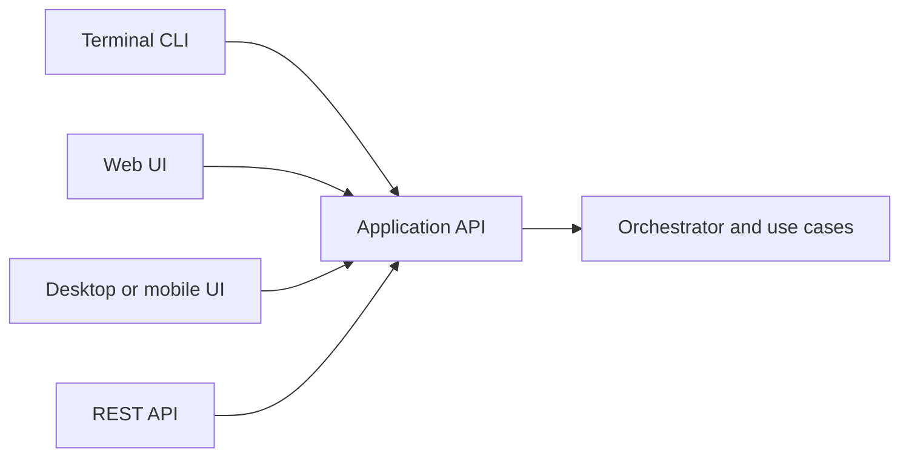

# Elly V2 Requirements

## 1. Purpose

This document defines the requirements for Elly V2 that address the architectural, extensibility, authorization, session-state, and user-interface problems identified after V1.5.

Each requirement is intended to be independently implementable and independently testable. Closely related observations are consolidated when they describe the same underlying responsibility or design problem.

This document specifies required outcomes and acceptance criteria. It does not prescribe an exact class layout unless a boundary is necessary to make the requirement verifiable.

## 2. Requirement Status and Terminology

**Status:** Completed and closed by owner decision on 2026-08-15. All nine
requirements passed deterministic verification. Limited live-provider quality
verification is an accepted deferred exception and is not claimed as passed.

The nine requirements were reconciled with the authoritative V1 SRS in
`PHASE_0_CONTRACT_FREEZE.md`. The owner's direct request to address all V2
blocking findings authorizes the requirement set, frozen public contracts, and
minimal in-process interface-parity adapters for implementation. Effectful
external actions remain deferred; V2 authorization contracts do not activate
those out-of-scope effects.

The words **shall**, **shall not**, **should**, and **may** have these meanings:

- **Shall**: mandatory for V2 acceptance.
- **Shall not**: prohibited in the V2 solution.
- **Should**: recommended unless a documented reason justifies another approach.
- **May**: optional implementation choice.

## 3. Consolidation Summary

| Source observation | Underlying problem | V2 requirement |
|---|---|---|
| 40 | The orchestrator recreates `LocalConversationUseCase` to compensate for private dependency mutation in tests or application code. | V2-ARCH-001 |
| 55 | Registered-capability execution combines too many workflow responsibilities in one orchestrator method. | V2-ARCH-002 |
| 56 | Direct research and specialist references coexist with the capability registry, creating two execution architectures. | V2-CAP-001 |
| 32, part of 46 | Keyword-based role markers cannot reliably determine whether a request belongs to a capability. | V2-INTENT-001 |
| 34, part of 46 | Generic cloud privacy and consent rules are mixed with and partially duplicated by specialist-specific policy. | V2-AUTH-001 |
| Part of 46 | Keyword matching cannot safely determine whether a proposed action is high impact. | V2-AUTH-002 |
| 60 | It is unclear whether a `/mode` change is durable or only local runtime state. | V2-SESSION-001 |
| 61 | The CLI accesses repositories and internal services directly, making another interface such as a web UI difficult to add safely. | V2-API-001 |
| 62 | A single growing `_command()` conditional handles every CLI command. | V2-CLI-001 |

---

## 4. Architecture Requirements

### V2-ARCH-001 — Stable Dependency Injection for Local Conversation

#### Problem

The orchestrator may recreate `LocalConversationUseCase` when its generalist dependency differs from `orchestrator._generalist`. This is compatibility logic for callers or tests that replace a private dependency after construction. It permits two objects that should represent the same dependency to become inconsistent.

#### Requirement

Elly shall construct the local-conversation workflow with its required dependencies through an explicit application composition mechanism. The orchestrator shall not recreate the local-conversation use case during request handling merely to synchronize a dependency that was mutated after construction.

Tests and application code shall replace dependencies through supported dependency-injection mechanisms rather than modifying private orchestrator attributes.

#### Required behavior

- The local-conversation use case shall receive its generalist dependency at construction time.
- The same configured use-case instance shall remain valid for the lifetime of its application scope unless the application explicitly rebuilds that scope.
- Production request handling shall not inspect private collaborator identity to decide whether to reconstruct a use case.
- Tests shall use constructor injection, a composition fixture, a factory, or another documented override seam.
- Unsupported post-construction mutation of a private dependency shall not be required for any test.

#### Acceptance criteria

1. No request path contains logic equivalent to “if the generalist changed, rebuild `LocalConversationUseCase`.”
2. A test can configure a fake generalist before constructing the application and verify that local conversation uses it.
3. Repeated requests use the same correctly constructed local-conversation use case within the configured application scope.
4. Existing local-conversation behavior remains compatible at the public application boundary.
5. Tests that formerly changed `orchestrator._generalist` are migrated to the supported injection seam.

#### Independence

This requirement can be completed without extracting capability execution or changing capability routing.

---

### V2-ARCH-002 — Dedicated Capability Execution Workflow

#### Problem

Registered-capability execution currently performs capability lookup, availability checks, input validation, authorization, consent, execution, persistence, audit, recovery, cancellation, and error translation in one large orchestrator method. This makes the conversation orchestrator difficult to understand and gives it responsibility for an entire use case.

#### Requirement

Elly shall move the end-to-end execution of an already selected registered capability behind a dedicated application-level workflow, referred to in this document as the **Capability Execution Workflow**.

The conversation orchestrator shall coordinate request context and routing, then delegate registered-capability processing to this workflow.

#### Required behavior

The Capability Execution Workflow shall coordinate, in a defined order:

1. Capability lookup.
2. Availability verification.
3. Typed input validation.
4. Privacy and action authorization.
5. Consent verification when required.
6. Capability execution.
7. Result validation and normalization.
8. Transactional or recoverable persistence.
9. Audit recording.
10. Cancellation handling.
11. Error translation into the shared failure taxonomy.

The orchestrator shall not duplicate these steps for individual registered capabilities.

#### Acceptance criteria

1. The orchestrator delegates an approved capability route through one stable application interface.
2. Unit tests exercise capability lookup, unavailable behavior, invalid inputs, blocked authorization, cancellation, execution errors, persistence errors, and audit errors without invoking the conversation orchestrator.
3. The sequence of authorization, execution, persistence, and audit is documented and covered by integration tests.
4. Partial or failed persistence cannot cause an unsuccessful capability result to be presented as fully completed.
5. A capability provider exception is translated into the documented application failure taxonomy and does not leak provider-specific exceptions to the interface.
6. Local conversation remains a separate use case and is not forced through this workflow unless explicitly designed as a registered capability in a later decision.

#### Independence

This extraction may initially delegate to existing policy and persistence components. It does not require the keyword-based intent or high-impact policy replacements to be completed first.

---

## 5. Capability and Intent Requirements

### V2-CAP-001 — Registry as the Sole Path for Optional Capability Execution

#### Problem

The orchestrator retains direct references to research and specialist components while optional feature execution increasingly uses `CapabilityRegistry`. Maintaining both approaches creates duplicated wiring, special cases, and additional orchestrator changes whenever a new capability is added.

#### Requirement

All dispatchable optional capabilities shall be discovered and executed through a typed capability registry and the Capability Execution Workflow. The conversation orchestrator shall not retain capability-specific execution dependencies for research, specialists, calendar, email, image, voice, or future optional capabilities.

Required core policies and infrastructure shall remain explicit dependencies and shall not be hidden inside the capability registry.

#### Required behavior

- Every optional capability shall expose a stable identifier, descriptor, availability state, input contract, output contract, authorization metadata, and execution interface.
- Research and specialist execution shall be migrated to the same registry contract used by future optional capabilities.
- Capability-specific provider objects may remain internal to their capability implementation.
- The registry shall contain dispatchable optional capabilities only; it shall not become a general service locator for repositories, audit, privacy policy, configuration, or other core dependencies.
- Removing or disabling a capability shall produce an explicit unavailable state rather than an attribute error or silent fallback.

#### Acceptance criteria

1. A test capability can be implemented, registered, routed to, and executed without modifying the conversation orchestrator, registry implementation, or existing capability implementations.
2. The orchestrator has no direct research-provider or specialist-provider execution branch.
3. Core dependencies such as routing, privacy authorization, persistence, and audit remain visible in application composition.
4. Duplicate capability identifiers are rejected during startup with an actionable configuration error.
5. An unregistered or unavailable capability produces the correct typed `UNAVAILABLE` result.
6. Existing research and specialist behaviors remain covered by integration tests after migration.

#### Independence

This requirement can use the existing router initially, provided the router returns a registered capability identifier. Structured intent improvements are governed separately by V2-INTENT-001.

---

### V2-INTENT-001 — Structured Capability Intent and Scope Validation

#### Problem

Keyword-based `role_markers` can reject valid capability requests that use unexpected wording and can accept unrelated requests that happen to contain configured terms. Extending keyword lists indefinitely will not provide a dependable capability boundary.

#### Requirement

Elly shall represent task intent and capability scope through typed, structured data. A capability shall validate whether a request is within its supported scope using that structured intent and its input schema, rather than relying solely on literal keyword matching.

#### Required behavior

- Intent interpretation shall produce a typed result containing at least the proposed capability, requested operation, relevant entities or inputs, confidence or ambiguity information, and the reason for the proposal.
- The proposed intent shall be treated as untrusted input and validated deterministically.
- Each capability shall define which structured operations and input shapes it supports.
- When intent is ambiguous or required fields are missing, Elly shall request clarification rather than guessing a consequential operation.
- Keyword rules may remain as deterministic signals or temporary compatibility aids, but shall not be the sole acceptance test for capability scope.
- An unavailable or unknown capability identifier shall never be executed merely because a model proposed it.

#### Acceptance criteria

1. Semantically equivalent requests with different wording resolve to the same structured operation when sufficient information is present.
2. Tests cover valid requests that contain none of the former role-marker keywords.
3. Tests cover irrelevant requests that contain misleading role-marker keywords and verify that they are not incorrectly accepted.
4. Invalid model-produced capability identifiers and unsupported operations are rejected deterministically.
5. Ambiguous requests return a typed clarification result.
6. Capability input validation can be unit tested without calling a live model or provider.

#### Independence

This requirement changes intent and scope validation only. Authorization of high-impact actions remains governed by V2-AUTH-002.

---

## 6. Authorization Requirements

### V2-AUTH-001 — Centralized Cloud Authorization and Specialist Policy Separation

#### Problem

Specialist execution currently owns both generic cloud privacy and consent rules and specialist-specific constraints such as depth, role, tools, and output limits. Some generic logic overlaps with the centralized `CloudAuthorizationPolicy`, risking inconsistent enforcement across capabilities.

#### Requirement

Elly shall enforce generic external-transmission authorization through one centralized cloud authorization policy. Specialist-specific constraints shall be enforced through a separate specialist execution policy. The specialist provider workflow shall execute only after both applicable policy decisions have approved the request.

#### Required behavior

The centralized cloud authorization policy shall own provider-independent decisions concerning:

- Payload privacy classification.
- Destination and provider identity.
- Consent existence, scope, destination, purpose, and expiration.
- Fail-closed behavior for missing classification or indeterminate authorization.
- Whether the proposed external payload is permitted to leave the trusted boundary.

The specialist execution policy shall own:

- Permitted specialist role.
- Requested analysis depth.
- Tool restrictions.
- Task or domain scope.
- Output constraints.
- Other specialist-only limitations.

Provider adapters shall not independently reinterpret or weaken either policy.

#### Acceptance criteria

1. Generic privacy and consent rules have one authoritative implementation used by every cloud-enabled capability.
2. Specialist-specific policy can be unit tested without a cloud provider, database, CLI, or live model.
3. A valid specialist scope cannot bypass failed cloud authorization.
4. Valid cloud consent cannot bypass a specialist-specific restriction.
5. Missing classification, expired consent, destination mismatch, and authorization-policy failure all block external transmission.
6. Tests demonstrate equivalent generic cloud-authorization behavior for at least two different cloud-enabled capabilities.
7. No provider adapter is responsible for deciding whether user consent is sufficient.

#### Independence

This requirement may be implemented while the current capability registry remains in place. It does not require the high-impact action policy described below.

---

### V2-AUTH-002 — Semantic High-Impact Action Policy

#### Problem

Literal high-impact markers such as `execute`, `write`, `send`, `delete`, and `trade` produce false positives and false negatives. Harmless text-generation requests may be blocked because they contain words such as “write,” while consequential actions may evade detection through synonyms such as “transmit” or indirect phrasing.

#### Requirement

Elly shall authorize consequential actions based on a typed action description and deterministic risk policy, not solely on keyword presence.

#### Required behavior

Before a capability performs an external or state-changing action, it shall provide a typed action proposal containing at least:

- Action category.
- Target resource or recipient when applicable.
- Expected side effect.
- Reversibility.
- Data sensitivity.
- Financial, legal, account, communication, or deletion impact as applicable.
- Whether explicit user confirmation is required.

The action policy shall distinguish generating content from performing the represented action. For example, drafting an email is not equivalent to sending it.

Unclassified, malformed, or ambiguous action proposals shall fail closed when execution could create a material side effect.

#### Acceptance criteria

1. “Write cleaner documentation” is not classified as an external write action merely because it contains the word `write`.
2. “Transmit this message to John” is recognized as a communication action even if it does not contain the word `send`.
3. Drafting a message and sending a message produce different action categories and authorization requirements.
4. Delete, financial transaction, external communication, account change, and irreversible-operation examples are covered by policy tests using varied wording.
5. Capability execution cannot proceed with a consequential action until the required confirmation or authorization is present.
6. Model-produced action classifications are schema validated and checked by deterministic policy before execution.
7. The audit record identifies the approved action category, target scope, and authorization decision without storing prohibited sensitive payloads.

#### Independence

This requirement can be implemented for state-changing capabilities incrementally. It does not require replacing capability scope validation at the same time.

---

## 7. Session-State Requirement

### V2-SESSION-001 — Authoritative and Durable Cloud Mode

#### Problem

The `/mode` command creates a new in-memory `SessionRecord`, but the observed code does not establish whether the changed cloud mode is persisted. If different interfaces or application instances use different values, cloud authorization behavior may become inconsistent.

#### Requirement

Elly shall define one authoritative cloud-mode state per session. A successful cloud-mode change shall be persisted through the application service and shall be visible consistently to subsequent requests and supported interfaces for that session.

If persistence fails, the command shall report failure and shall not present the new mode as durably applied.

#### Required behavior

- Mode changes shall go through a public application operation rather than direct replacement of interface-owned session state.
- The mode update shall validate the requested transition.
- The authoritative session store shall record the accepted mode.
- The active application state shall not contradict the persisted state after a successful operation.
- A newly created application or web request loading the same session shall observe the latest persisted mode.
- Mode changes shall produce an audit event without exposing private conversation content.
- Concurrent updates shall not silently overwrite a newer mode without the repository’s defined concurrency behavior.

#### Acceptance criteria

1. Change a session from local-only to cloud-permitted, reload the session from persistence, and observe cloud-permitted.
2. A persistence failure leaves the authoritative mode unchanged and returns a typed failure.
3. The CLI and a second interface using the same application API observe the same mode.
4. Invalid mode values and invalid transitions are rejected.
5. An audit record captures the session identifier, previous mode, new mode, timestamp, and outcome.
6. Integration tests define behavior for concurrent or stale mode updates.

#### Independence

This requirement can be implemented without changing capability execution or CLI command dispatch.

---

## 8. Interface and Application API Requirements

### V2-API-001 — Interface-Neutral Application API

#### Problem

The CLI reaches into repositories, profile storage, audit services, specialist consent state, and other application internals. This couples presentation code to implementation details and would force every additional interface to duplicate application behavior.

Without a shared boundary, routing, privacy classification, authorization, consent, redaction, cancellation, and error-handling logic could be reimplemented differently in the CLI, web UI, desktop or mobile UI, and REST API. That duplication could produce inconsistent behavior and privacy enforcement depending on which interface the user chooses.

#### Requirement

Elly shall expose one interface-neutral application API for all supported user operations. Terminal, web, desktop, mobile, and programmatic interfaces shall call this shared application boundary rather than implementing or bypassing application policy.

Routing, privacy classification, authorization, consent enforcement, capability selection, orchestration, persistence coordination, cancellation semantics, and failure translation shall be owned below the interface layer and reused by every interface.

The intended dependency structure is:

Interfaces shall not directly access repositories, audit sinks, provider adapters, workflow internals, consent storage, or mutable profile state.

#### Required operations

The application API shall provide typed operations, as applicable, for:

- Submit a conversation request.
- Create or select a session.
- Read and change session mode.
- Cancel a task.
- Read profile information through approved views.
- List conversation history.
- Retrieve task trace information.
- Retrieve task sources.
- Create and restore supported backups.
- List, approve, or deny pending consent proposals.
- Read application and capability status.

Exact method names are an implementation decision; the behavioral boundary is mandatory.

#### Required behavior

- API request and response types shall not expose database rows, provider SDK objects, or mutable internal service objects.
- Interfaces shall be thin adapters responsible for input parsing, transport-specific authentication or session binding, presentation, and conversion to and from public application types.
- Interfaces shall not implement independent routing, privacy classification, cloud authorization, consent, capability-selection, or fallback rules.
- The same validated application request shall reach the same routing and policy decisions regardless of the interface from which it originated, except where an explicit interface capability or authenticated-user context legitimately differs.
- Authorization, filtering, redaction, and not-found behavior shall be consistent across interfaces.
- Trace, source, profile, and consent operations shall return only fields approved for presentation.
- Interface code shall not append directly to the audit log or directly modify repositories.
- The API shall support asynchronous or long-running task behavior needed by a web interface, including stable task identifiers, status retrieval, and cancellation.
- The API shall distinguish user-correctable errors, unavailable capabilities, blocked operations, and internal failures through typed results.

#### Acceptance criteria

1. The CLI performs its supported operations without directly referencing a repository, audit sink, specialist workflow, consent store, or mutable profile implementation.
2. A minimal test web adapter can submit a request, retrieve status, obtain sources, and cancel a task using only the public application API.
3. Contract tests run the same representative operations through CLI and web adapters and observe equivalent application outcomes.
4. Equivalent requests submitted through CLI, web, desktop/mobile, and REST test adapters produce the same route, privacy decision, authorization decision, capability selection, and application status when given the same user and session context.
5. No interface implementation contains its own copy of routing, privacy, consent, or capability-authorization policy.
6. A policy correction made in the application layer takes effect for every interface without modifying the interface adapters.
7. Internal repository models and provider-specific exceptions do not appear in public API responses.
8. Profile, trace, source, and consent responses are covered by redaction and authorization tests.
9. Public application API contracts are documented and versioned or changed through an explicit compatibility policy.

#### Independence

The public API may initially delegate to existing internal services. Internal extraction can occur separately as long as interfaces do not bypass the API.

---

### V2-CLI-001 — Extensible CLI Command Dispatch

#### Problem

One `_command()` method handles an expanding list of commands through a long conditional chain. Adding files, calendar, email, model, or settings commands would make the method increasingly difficult to maintain and test.

#### Requirement

The CLI shall dispatch commands through a command registry or equivalent modular handler mechanism. Each command handler shall depend only on the public application API and interface-level presentation utilities.

#### Required behavior

- Each command shall have a stable command name and a dedicated handler or handler object.
- Command metadata shall define usage, help text, aliases if supported, and argument validation.
- The dispatcher shall provide consistent handling for unknown commands, malformed arguments, typed application errors, and help output.
- Adding a command shall not require adding another branch to a central command conditional.
- Command handlers shall not contain application policy or provider-specific execution logic.
- Shared parsing and presentation behavior shall not be duplicated across handlers.

#### Acceptance criteria

1. Existing commands—including help, exit, status, new, mode, cancel, profile, history, trace, sources, backup, restore, approve, and deny—are registered through the new dispatch mechanism.
2. A test command can be added and executed by registration without modifying the dispatcher implementation.
3. Each command handler can be unit tested with a fake public application API.
4. Unknown commands and invalid arguments produce consistent, user-readable results.
5. Command help can be generated from registered metadata so it does not drift from available commands.
6. The central input loop remains small and is responsible only for reading input, distinguishing commands from conversation input, dispatching, and presenting results.

#### Independence

This requirement can be implemented after the public application API boundary exists, without changing application routing or capability execution.

---

## 9. Cross-Cutting Verification Requirements

### 9.1 Backward-compatible behavior

Unless a V2 requirement explicitly changes behavior, existing supported V1.5 user workflows shall continue to work through the public application interface.

### 9.2 Test levels

The V2 implementation shall include:

- Unit tests for each extracted policy, workflow, application operation, and command handler.
- Contract tests for capability handlers and the public application API.
- Integration tests for routing through capability execution, cloud authorization, session-mode persistence, consent decisions, persistence recovery, and cancellation.
- Interface parity tests for operations supported by both CLI and web adapters.
- Migration tests using a representative V1.5 database.

### 9.3 Failure taxonomy

New V2 components shall preserve the established meanings of `FAILED`, `PARTIAL`, `BLOCKED`, `UNKNOWN`, `UNAVAILABLE`, and `CANCELLED`. Interface adapters shall not reinterpret these statuses inconsistently.

### 9.4 Logging and audit safety

Refactoring shall not weaken sensitive-data redaction. Logs, traces, and audit records shall not contain credentials, tokens, full consent-protected payloads, prohibited private content, or provider request bodies.

### 9.5 Startup validation

Application startup shall reject invalid dependency composition, duplicate capability identifiers, incompatible capability contracts, and enabled capabilities with missing required configuration. Intentionally disabled optional capabilities shall remain valid and shall report an explicit disabled or unavailable state.

## 10. Recommended Implementation Order

The requirements are independently testable, but the following order minimizes temporary adapters and duplicate work:

1. **V2-API-001** — establish the interface-neutral application boundary.
2. **V2-SESSION-001** — move mode mutation behind the application boundary and make it durable.
3. **V2-ARCH-001** — remove the legacy generalist synchronization seam.
4. **V2-ARCH-002** — extract capability execution from the orchestrator.
5. **V2-CAP-001** — migrate optional capabilities to the single registry path.
6. **V2-AUTH-001** — centralize cloud authorization and separate specialist policy.
7. **V2-INTENT-001** — introduce structured intent and scope validation.
8. **V2-AUTH-002** — introduce typed high-impact action authorization.
9. **V2-CLI-001** — migrate CLI commands to modular handlers using the public API.

This order is recommended, not a requirement. A milestone plan may rearrange the work if it preserves the stated boundaries and acceptance criteria.

## 11. V2 Completion Criteria

These problem areas are considered addressed when:

1. All nine V2 requirements are implemented or explicitly deferred through an approved scope decision.
2. Each implemented requirement satisfies every mandatory acceptance criterion.
3. The conversation orchestrator no longer owns capability authorization, execution, persistence, and recovery as one large responsibility cluster.
4. Optional capabilities use one typed registry execution path.
5. Capability scope and consequential-action decisions are not based solely on keywords.
6. Generic cloud authorization has one authoritative policy implementation.
7. Session cloud mode is authoritative, durable, and consistent across interfaces.
8. CLI and web-facing code use the same public application API.
9. New CLI commands and optional capabilities can be added through registration without expanding central conditional dispatch.
10. Regression, migration, privacy, cancellation, persistence, and failure-taxonomy tests pass.

## 12. Explicit Non-Goals

This requirements set does not require V2 to:

- Implement every example capability listed in this document.
- Deliver a complete production web UI; it requires the application boundary needed to support one.
- Replace all deterministic keyword signals when they remain useful as secondary hints.
- Adopt a dynamically loaded third-party plugin marketplace.
- Place core services or policies in the capability registry.
- Allow a language model to authorize external transmission or consequential actions.
- Change pricing or billing behavior.
