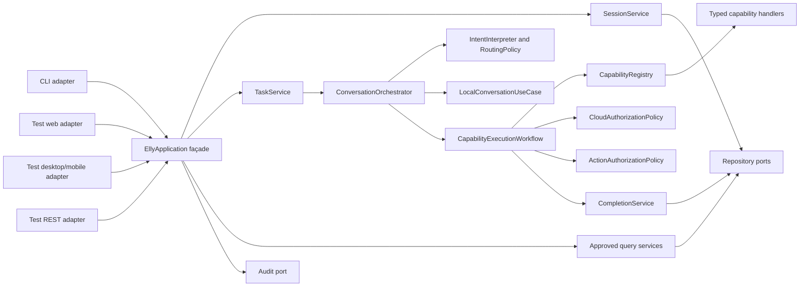

# Elly V2 Technical Design

**Status:** Implemented, verified, and closed by owner decision 2026-08-15  
**Requirements source:** [REQUIREMENTS.md](REQUIREMENTS.md)  
**Baseline:** Elly V1.5 modular monolith and SQLite schema version 3  
**Audience:** Implementers, reviewers, and test authors

## 1. Purpose and scope

This document translates the nine approved V2 requirements into an implementable
technical design. It is subordinate to `REQUIREMENTS.md`: if this design and an
approved requirement disagree, the requirement wins and this document must be
updated.

V2 remains a Python modular monolith with ports and adapters. It does not add a
generic workflow engine, dependency-injection framework, plugin marketplace, or
production web server. The main change is to put stable application boundaries
around behavior that already exists, then replace fragile intent and action
keyword checks with typed proposals plus deterministic validation.

The design preserves these V1.5 properties:

- local conversation is a required use case, not an optional capability;
- optional research and specialist features can be unavailable;
- models and providers never authorize themselves;
- `TaskResult` retains separate task, epistemic, and validation axes;
- `OutcomeCode` carries `UNAVAILABLE`, `UNKNOWN`, and other outcome meanings;
- SQLite remains the authoritative local store;
- provider calls remain behind typed ports and guardrails;
- audit data remains metadata-only and redacted.

## 2. Requirements analysis

### 2.1 Current baseline and principal gaps

The V1.5 implementation already supplies useful foundations: a composition root,
typed domain models, `CapabilityRegistry`, `RoutingPolicy`,
`CloudAuthorizationPolicy`, cancellation tokens, idempotency records, and durable
task/audit/source metadata. V2 should evolve these rather than create parallel
systems.

The gaps observed in the current code are:

| Requirement | Current condition | Required design change |
| --- | --- | --- |
| V2-ARCH-001 | `ConversationOrchestrator` owns both `generalist` and a constructed `LocalConversationUseCase`; tests mutate `_generalist`. | Construct the local use case once in composition and inject only that use case into the orchestrator. |
| V2-ARCH-002 | `_execute_registered_capability()` owns lookup through completion and error mapping. | Extract a dedicated `CapabilityExecutionWorkflow`. |
| V2-CAP-001 | Registry dispatch exists, but the orchestrator still accepts and stores research and specialist dependencies and can construct handlers. | Compose handlers only in the composition root; make registry execution the sole optional path. |
| V2-INTENT-001 | `RouteProposal` lacks operation, entities, confidence, ambiguity, and rationale; specialist scope uses role keywords. | Add `CapabilityIntent` and deterministic per-capability input/scope validation. |
| V2-AUTH-001 | Central cloud authorization exists, but `SpecialistWorkflow` repeats privacy, consent, cloud-mode, and classification checks. | Run generic cloud policy once in capability execution; leave specialist-only limits in `SpecialistExecutionPolicy`. |
| V2-AUTH-002 | Specialist recommendations are blocked by a literal high-impact word list. | Add typed `ActionProposal`, schema validation, deterministic risk policy, and exact confirmation. |
| V2-SESSION-001 | `/mode` replaces the CLI's `SessionRecord` without persistence. | Add versioned compare-and-set session mode update through the application API. |
| V2-API-001 | `Application` exposes internals and the CLI calls repositories, audit, profile, backup, consent, clock, config, and workflows directly. | Introduce a narrow `EllyApplication` façade with public request/response DTOs and no exposed collaborators. |
| V2-CLI-001 | `Cli._command()` is a long conditional and handlers call internals. | Add command descriptors, registry, dispatcher, and one handler per command using only the façade. |

### 2.2 Requirement interactions

The requirements are independently testable, but four dependency relationships
matter during implementation:

1. The application API must exist before CLI handlers can become thin.
2. Durable mode changes need a repository operation but do not depend on routing
   or capability extraction.
3. The capability execution workflow should be extracted before research and
   specialists lose their direct wiring; otherwise temporary orchestration logic
   would be duplicated.
4. Structured intent and action authorization share proposal-validation patterns,
   but are separate decisions. Intent answers *what is requested*; action policy
   answers *whether the resulting side effect may execute*.

### 2.3 Decisions made by this design

- `EllyApplication` is an in-process façade. A future REST or web adapter maps
  transport DTOs to it; transport concerns do not enter the application layer.
- The authoritative session is loaded by session ID for each operation. A client
  does not submit trusted `cloud_mode` or `persistence_mode` values.
- Session concurrency uses optimistic locking through a monotonically increasing
  `version` field.
- Optional capability selection is expressed by a stable `capability_id` and
  operation, not by adding a new orchestrator branch or necessarily a new
  `Route` enum member.
- Capability handlers validate and convert a generic intent envelope into their
  own typed input before any authorization or provider call.
- A model may propose intent or an action, but only application-owned schema and
  policy code may accept it.
- Consequential actions require an approval bound to the normalized action
  digest. Cloud consent and action confirmation are different approvals and both
  are required when both policies apply.
- The existing SQLite audit table remains the authoritative audit sink. If a
  separate sink is configured later, an outbox is required before claiming
  reliable completion.

## 3. Target architecture



Dependency direction is presentation -> public application API -> application
services/use cases -> domain and ports -> adapters. No presentation module may
import an adapter, repository port, internal workflow, mutable service, or
provider DTO.

### 3.1 Application scopes

The composition root builds one application scope containing immutable wiring:

- one `LocalConversationUseCase` with its selected `GeneralistPort`;
- one validated `CapabilityRegistry`;
- one `CapabilityExecutionWorkflow`;
- routing, intent, privacy, cloud, action, specialist, completion, and session
  policies/services;
- repository, audit, clock, guardrails, backup, and provider adapters;
- one `EllyApplication` façade.

These collaborators are not replaced after construction. Tests needing a fake
build a scope with overrides through `build_application(overrides=...)` or a
test fixture. There is no production or test path that mutates private
orchestrator attributes.

Per-request state consists of immutable request DTOs, an execution context,
cancellation token, guardrail ledger, and any policy decisions. Mutable active
task tracking belongs to `TaskService`, keyed by task ID; it does not live as one
global `_active_cancellation` slot.

## 4. Public application API

### 4.1 Boundary

Add `src/elly/api/contracts.py` and `src/elly/api/application.py`. The public
class may be named `EllyApplication`; the name is less important than keeping its
surface explicit and versioned.

```python
class EllyApplication:
    def create_session(self, request: CreateSessionRequest) -> ApiResult[SessionView]: ...
    def get_session(self, session_id: str) -> ApiResult[SessionView]: ...
    def change_session_mode(self, request: ChangeModeRequest) -> ApiResult[SessionView]: ...

    def submit(self, request: SubmitRequest) -> ApiResult[TaskAccepted]: ...
    def get_task(self, task_id: str) -> ApiResult[TaskView]: ...
    def cancel_task(self, task_id: str) -> ApiResult[TaskView]: ...

    def get_profile(self, request: ProfileQuery) -> ApiResult[ProfileView]: ...
    def change_profile(self, request: ProfileCommand) -> ApiResult[ProfileView]: ...
    def list_history(self, request: HistoryQuery) -> ApiResult[HistoryView]: ...
    def delete_session(self, request: DeleteSessionRequest) -> ApiResult[None]: ...
    def get_trace(self, request: TraceQuery) -> ApiResult[TraceView]: ...
    def get_sources(self, request: SourcesQuery) -> ApiResult[SourcesView]: ...

    def list_consents(self, request: ConsentQuery) -> ApiResult[ConsentListView]: ...
    def decide_consent(self, request: ConsentDecisionRequest) -> ApiResult[TaskView]: ...
    def decide_action(self, request: ActionDecisionRequest) -> ApiResult[TaskView]: ...

    def create_backup(self, request: BackupRequest) -> ApiResult[BackupView]: ...
    def restore_backup(self, request: RestoreRequest) -> ApiResult[RestoreView]: ...
    def get_status(self) -> ApiResult[ApplicationStatusView]: ...
```

Exact Python names may change, but all required operations must be reachable
without access to `Application` internals. `EllyApplication` exposes no public
`repository`, `audit`, `clock`, `config`, `profile`, `backup`, `orchestrator`,
provider, consent workflow, or specialist workflow attribute.

### 4.2 Public DTO rules

Public DTOs are frozen dataclasses containing primitives, enums intended for the
public contract, and other public DTOs. They never contain:

- SQLite rows or repository models;
- `Future`, provider SDK objects, exceptions, mutable services, or ports;
- message bodies in trace, status, source, or consent views;
- secret configuration values;
- internal `AuditEvent.detail` without presentation redaction.

`SubmitRequest` contains `request_id`, `session_id`, validated text, and optional
intent/approval correlation fields. It does **not** contain authoritative cloud
or persistence mode. `TaskService` loads the session and constructs the internal
`TaskRequest` from durable state, closing the stale or forged mode gap.

`ApiResult[T]` contains one of `value` or a typed `ApiFailure`:

```text
ApiFailure
  code: INVALID_INPUT | NOT_FOUND | CONFLICT | BLOCKED | UNAVAILABLE |
        CANCELLED | INTERNAL_FAILURE
  safe_message: string
  retryable: boolean
  correlation_id: string
```

Task outcomes continue to use `TaskStatus`, `OutcomeCode`, `EpistemicStatus`, and
`ValidationStatus`; interface adapters render them but never reinterpret them.
Provider-specific exceptions are translated at their adapter boundary into
`EllyError`, then into an application result at the façade boundary.

### 4.3 Asynchronous task semantics

`submit()` validates, creates/claims a durable task, schedules it through the
bounded executor, and returns a stable task ID. `get_task()` reads durable task
state and returns a completed public result when available. A convenience
`submit_and_wait()` may exist for the CLI but must be implemented in terms of the
same task service, not a separate execution route.

Cancellation is `cancel_task(task_id)`, not `cancel_active()`. `TaskService`
keeps an in-memory map of live cancellation tokens and uses the durable task row
for status. Unknown, already terminal, queued, and running tasks return distinct
typed outcomes. After restart, formerly running tasks are marked interrupted by
the existing startup recovery and no stale token is implied.

Minimal web, desktop/mobile-client, and REST adapters used for contract testing
need only four endpoints or equivalent methods: submit, task status, sources,
and cancel. These may be lightweight in-process adapters; production HTTP,
authentication, CSRF protection, client packaging, UI construction, and
deployment are outside V2 scope.

### 4.4 Compatibility policy

The Python public API is versioned as `api/v2` in documentation and contract
tests. Additive fields with defaults are compatible. Removing or changing field
meaning, enum meaning, or required behavior requires a documented compatibility
decision and a major API version change. Existing CLI behavior is preserved at
the user level unless a V2 requirement explicitly corrects it.

## 5. Session authority and durable mode

### 5.1 Session model

Extend the persisted session record and public view with:

```text
Session
  session_id: string
  persistence_mode: PersistenceMode
  cloud_mode: CloudMode
  created_at: UTC datetime
  updated_at: UTC datetime
  version: integer >= 1
```

`SessionService.change_mode(ChangeModeRequest)` performs:

1. Validate session ID, target mode, actor context, and expected version.
2. Load the current session or return `NOT_FOUND`.
3. Validate the transition through `SessionModePolicy`.
4. Call the repository compare-and-set update in one SQLite transaction.
5. Append a redacted audit event in the same transaction when SQLite is the
   configured audit store.
6. Return the newly loaded `SessionView`.

The repository operation is conceptually:

```python
update_cloud_mode(
    session_id: str,
    expected_version: int,
    new_mode: CloudMode,
    at: datetime,
) -> SessionRecord
```

It executes an update constrained by `session_id` and `version`. Zero affected
rows causes a typed `ConflictError`; the caller reloads rather than overwriting.
On any persistence or audit failure, the transaction rolls back and the public
result reports failure. There is no interface-owned copy treated as authority.

The CLI replaces its cached session with the returned view after success and
reloads it before submission. A web or second in-process adapter using the same
session ID observes the same durable value.

### 5.2 Session migration

In the next additive SQLite migration:

- add `sessions.updated_at`, initially copied from `created_at`;
- add `sessions.version INTEGER NOT NULL DEFAULT 1`;
- retain all historical cloud and persistence enum values unchanged.

Migration tests start from the representative V1.5/schema-version-3 database,
upgrade it, verify every row, update a mode, close/reopen the repository, and
verify the value and version.

## 6. Conversation orchestration and dependency injection

### 6.1 Reduced orchestrator responsibility

After V2 extraction, `ConversationOrchestrator.handle()` performs only:

1. Resolve durable session/request context supplied by `TaskService`.
2. Build bounded conversation context.
3. Obtain structured intent and a deterministic route decision.
4. Persist/claim the request lifecycle through `TaskService` or
   `CompletionService`.
5. Delegate to `LocalConversationUseCase` or
   `CapabilityExecutionWorkflow`.
6. Return the normalized `ConversationOutcome`.

It does not authorize cloud transfer, check consent, validate a capability's
typed input, call an optional provider directly, persist optional results field
by field, append capability audit events, or translate provider exceptions.

### 6.2 Stable local-conversation injection

`ConversationOrchestrator` accepts `local_conversation: LocalConversationUseCase`
as a required constructor dependency. Remove its `generalist`, model ID, output
limit, and fallback local-use-case construction parameters. Remove the
`_generalist` attribute and any identity synchronization logic.

Composition constructs:

```python
local = LocalConversationUseCase(
    generalist=generalist,
    model_id=config.generalist_model_id,
    max_output_tokens=config.generalist_max_output_tokens,
    guardrails=guardrails,
)
orchestrator = ConversationOrchestrator(local_conversation=local, ...)
```

Tests use a `CompositionOverrides` value or fixture that supplies a fake
`GeneralistPort` before construction. Tests that currently assign
`orchestrator._generalist` or mutate a provider after construction must be
rewritten. Rebuilding an entire test application scope is the supported way to
change wiring.

## 7. Structured intent and routing

### 7.1 Intent contract

Replace `RouteProposal` as the primary proposal with this richer contract:

```text
CapabilityIntent
  proposed_capability_id: string | null
  operation: string
  entities: tuple[IntentEntity, ...]
  arguments: immutable typed/scalar map
  confidence: float in [0, 1]
  ambiguity: CLEAR | AMBIGUOUS | MISSING_FIELDS | NONE_PROPOSED
  rationale_code: safe enum/string

IntentEntity
  kind: string
  value: string
  source: EXPLICIT | CONTEXTUAL | INFERRED
```

`rationale_code` is a bounded diagnostic, not hidden model reasoning. Model text
or chain-of-thought is never stored. The interpreter may initially combine the
existing deterministic routing signals with a fake or local structured
classifier; no live model is required to test validation.

### 7.2 Validation pipeline

Intent handling follows this order:

1. Parse the interpreter output against the `CapabilityIntent` schema.
2. Reject unknown capability IDs before registry lookup can execute anything.
3. Resolve the descriptor and verify availability.
4. Ask the handler's input factory to validate the operation, required entities,
   and argument shapes and to produce a capability-specific request type.
5. Return `ClarificationRequired` for ambiguity or missing required values.
6. Produce a deterministic `RouteDecision` referencing the registered capability
   and validated operation.

Extend the capability contract with a side-effect-free validation operation:

```python
class CapabilityHandler(Protocol[InputT, OutputT]):
    @property
    def descriptor(self) -> CapabilityDescriptor: ...
    def status(self) -> CapabilityStatus: ...
    def prepare(self, intent: CapabilityIntent, context: RequestContext) \
        -> PreparationResult[InputT]: ...
    def propose_action(self, request: InputT) -> ActionProposal: ...
    def execute(self, request: InputT, context: ExecutionContext) -> OutputT: ...
```

`prepare()` replaces keyword-only `can_handle()` for scope acceptance. It cannot
call a provider or mutate state. Each handler supports an explicit set of
operation IDs and typed input variants. For example, research may support
`research.search`; coding specialist may support `specialist.analyze_code`.

Keyword rules may contribute a deterministic signal and provide backward
compatibility while characterization tests are retained. They may not be the
only capability scope gate. The existing `SpecialistWorkflow._validate_scope()`
role marker requirement is removed once typed specialist inputs are active.

### 7.3 Clarification result

Add `OutcomeCode.CLARIFICATION_REQUIRED` or an equivalent public result code.
The task does not execute a capability, transmit data, or consume an approval.
The response lists only the missing/ambiguous public fields. It does not guess a
recipient, target, amount, deletion scope, or other consequential value.

## 8. Optional capability registry and execution workflow

### 8.1 Registry boundaries

`CapabilityRegistry` contains only dispatchable optional handlers. Startup
validation checks:

- unique, non-empty stable identifiers;
- valid descriptor and handler contract types;
- unique operation IDs within each descriptor;
- compatible input/output schema versions;
- required external destination metadata when enabled;
- required configuration for enabled capabilities;
- explicit `UNAVAILABLE`/`DISABLED` status for intentionally disabled handlers.

The registry never returns a repository, policy, logger, configuration object,
clock, audit sink, or other core service. Adding a test capability requires only
implementing the protocol and registering it at composition.

Research and each specialist are composed as handlers in `composition.py`.
Delete research/specialist constructor parameters and fallback handler
construction from `ConversationOrchestrator`. Delete its capability-to-route
special cases once compatibility mapping resides in routing or descriptors.

### 8.2 Capability execution input and result

The workflow receives an already selected capability and prepared typed input:

```text
CapabilityExecutionCommand
  task_id
  request_id
  session snapshot
  capability_id
  operation
  prepared_input
  context manifest
  cloud consent approval ID, optional
  action confirmation ID, optional
  execution context
```

It returns `CapabilityExecutionOutcome`, containing normalized `TaskResult`,
context manifest, optional consent/action proposal, and safe decision metadata.
Provider or handler-specific objects never escape.

### 8.3 Required execution sequence

`CapabilityExecutionWorkflow.execute()` owns this exact order:

1. Look up the handler by ID.
2. Verify current availability.
3. Verify the prepared input type/schema and operation against the descriptor.
4. Classify the exact outbound payload, if any.
5. Obtain centralized cloud authorization, if an external boundary is declared.
6. Obtain the handler's typed action proposal.
7. Evaluate deterministic action authorization and confirmation.
8. Claim/reuse the idempotency operation record.
9. Record prerequisite authorization/audit metadata.
10. Check cancellation immediately before dispatch.
11. Execute the handler/provider through guardrails.
12. Validate and normalize the returned output.
13. Persist result, assistant message, sources, provenance, task state, operation
    state, and audit completion through `CompletionService`.
14. Translate failures to the shared outcome and error taxonomy.

Authorization precedes idempotency claim if the claim is only bookkeeping and
has no external effect. If the operation record is needed to bind an approval,
it may be created earlier in a non-executing `awaiting_authorization` state. In
all cases, no provider dispatch occurs before both applicable policies approve.

### 8.4 Persistence and failure semantics

`CompletionService` owns durable local completion. With the current
SQLite-backed audit implementation, one transaction should update the task and
operation, append the assistant message/source/provenance rows, store a normalized
task result view, and append the audit event. This requires repository methods
that express the transaction as one operation rather than public callers issuing
individual writes.

If execution succeeds but completion persistence fails, return `PARTIAL` with
`UNKNOWN` validation/durability semantics and retain a failed or
possible-duplicate operation marker when possible. Never return `COMPLETED`.
If execution never began, map storage failure to `FAILED`. Provider exceptions
are normalized by adapters and mapped by the workflow; they never reach an
interface.

Do not claim transactionality across SQLite and an external provider. Retain the
existing idempotency key and provider idempotency key where supported. When a
provider cannot prove whether a timed-out action executed, use
`POSSIBLE_DUPLICATE_EXECUTION` and require reconciliation before retrying a
consequential action.

Cancellation before dispatch starts no call. Cancellation during a supported
call invokes the provider cancellation port. Validated partial work may be
stored only as `partial_work`; it is never a completed answer.

## 9. Authorization design

### 9.1 Central cloud authorization

`CloudAuthorizationPolicy` remains the single provider-independent owner of:

- exact payload classification and fail-closed unclassified handling;
- session cloud mode;
- destination/provider/model identity;
- consent existence, payload digest, scope, purpose, cost, expiry, and one-time
  consumption;
- external-boundary permission.

The policy should accept an immutable `CloudAuthorizationRequest` rather than a
long parameter list and return `AuthorizationDecision`. It audits safe metadata:
capability, operation, destination, classification, digest prefix, decision code,
and approval ID. It never stores payload text.

Every cloud-enabled capability is covered by the same policy contract tests.
The research and specialist handlers declare outbound payload construction; they
cannot bypass authorization or reinterpret consent.

### 9.2 Specialist execution policy

Extract `SpecialistExecutionPolicy.evaluate(SpecialistPolicyRequest)` as a pure,
provider-free component. It owns:

- manifest role and task/domain scope;
- delegation depth;
- allowed/disabled tools;
- output and analysis-depth limits;
- specialist-specific prohibited operations.

Remove cloud mode, generic privacy, classification consistency, destination,
and consent checks from `SpecialistWorkflow`. The workflow receives a policy-
approved typed specialist request and performs provider execution only. Both
cloud and specialist decisions must approve before execution.

### 9.3 Typed action proposal

Introduce:

```text
ActionProposal
  category: NONE | CONTENT_DRAFT | EXTERNAL_COMMUNICATION | DELETE |
            FINANCIAL_TRANSACTION | ACCOUNT_CHANGE | EXTERNAL_WRITE |
            IRREVERSIBLE_OPERATION
  target: structured target or null
  side_effect: NONE | LOCAL_STATE | EXTERNAL_STATE
  reversibility: REVERSIBLE | PARTIALLY_REVERSIBLE | IRREVERSIBLE | UNKNOWN
  data_sensitivity: PUBLIC | LOCAL | RESTRICTED | UNCLASSIFIED
  impact_flags: tuple[FINANCIAL | LEGAL | ACCOUNT | COMMUNICATION | DELETION, ...]
  confirmation_required: boolean
  source: CAPABILITY_DECLARED | MODEL_PROPOSED
```

Capability code, not the general model, is responsible for declaring whether an
operation creates a side effect. A model-produced proposal must pass the same
schema, but cannot reduce the minimum risk declared by the capability descriptor
or operation. The deterministic policy takes the maximum of descriptor-declared
risk and validated proposal risk.

`CONTENT_DRAFT` has no external side effect; drafting an email does not authorize
`EXTERNAL_COMMUNICATION`. Sending/transmitting a message does. Malformed,
unknown, or ambiguous proposals fail closed whenever an external or material
state change is possible.

### 9.4 Action confirmation

For confirmation-required actions, create an `ActionConfirmationProposal` bound
to:

- task/request ID;
- capability and operation;
- normalized category and target scope;
- normalized action digest;
- expiry and one-time-use nonce.

Approval is checked immediately before execution. A changed target, payload
digest, amount, category, or operation invalidates it. Audit records contain the
category, normalized safe target reference, decision, and digest—not the payload.
Cloud consent does not satisfy action confirmation and vice versa. Retain
`AWAITING_CONSENT` for exact cloud consent and add a distinct
`AWAITING_CONFIRMATION` task/outcome state for consequential-action confirmation;
interfaces must not present one as the other.

V2 can introduce this incrementally for state-changing handlers. Until a handler
implements a valid action proposal, it must declare `NONE` only if it is truly
read-only; otherwise it remains unavailable or blocked.

## 10. CLI design

### 10.1 Command registry

Add `presentation/commands/` containing:

```text
base.py             CommandDescriptor, CommandContext, CommandHandler protocol
registry.py         CommandRegistry and startup validation
dispatcher.py       tokenization, lookup, common error/result rendering
help.py             generated help
session.py          new and mode handlers
tasks.py            cancel, trace, and sources handlers
profile.py          profile handlers
history.py          history handlers
consent.py          approve and deny handlers
backup.py           backup and restore handlers
status.py           status handler
lifecycle.py        exit handler
```

One descriptor contains canonical name, aliases, usage, help, and argument
parser/validator metadata. `CommandRegistry` rejects duplicate names and aliases.
Help is generated from registered descriptors.

`CommandHandler.handle(args, context)` receives only the public
`EllyApplication`, current public `SessionView`, and presentation utilities. It
returns a presentation result containing rendered text, optional updated session,
and optional loop control. It cannot import or receive repositories, audit,
providers, workflows, configuration internals, or mutable profile state.

### 10.2 Input loop

The final CLI loop only:

1. reads and normalizes input;
2. distinguishes slash command from conversational text;
3. dispatches commands or submits through the public API;
4. renders the public result;
5. updates its cached `SessionView` from successful API responses.

Unknown commands, invalid arguments, application failures, and help use common
dispatcher behavior. A new test command is added by registration only; neither
the dispatcher nor input loop changes.

All existing commands listed in V2 requirements must be registered before the
old `_command()` conditional is removed. Approval handlers call
`decide_consent()` and never append audit events or access a specialist workflow.

## 11. Persistence changes

Use additive migrations and never edit migrations 1-3. The first V2 migration
number is the next internal SQLite schema number (currently 4), independent of
the product version name.

Minimum schema changes:

| Storage change | Purpose |
| --- | --- |
| `sessions.updated_at`, `sessions.version` | Durable optimistic mode changes. |
| normalized task-result columns or `task_results` table | Allow public task status/result retrieval without internal objects. |
| operation/action metadata columns or companion table | Bind capability operation, risk category, target digest, and approval state. |
| optional consent/action proposal tables | Needed only if proposals must survive process restart; otherwise document application-scope lifetime. |

This design does not require durable consent proposals merely to satisfy the V2
boundary: an application-scoped `ConsentStorePort` may initially back list,
approve, and deny operations. If restart recovery or multiple application
processes are supported, proposal and one-time consumption state must become
durable before that deployment is accepted.

Prefer narrow persistence ports by aggregate rather than continuing to grow
`SessionRepositoryPort` into a general database service:

- `SessionStorePort` for sessions and messages;
- `TaskStorePort` for lifecycle, results, operations, sources, and provenance;
- `ProfileStorePort` for approved profile views/commands;
- `AuditPort` for redacted events;
- `ConsentStorePort` and `ActionConfirmationStorePort` if persisted.

The SQLite adapter may implement several ports over one connection. Transaction
coordination belongs to a SQLite unit-of-work adapter or one atomic repository
method, not to presentation or capability handlers.

Backup and restore remain application operations. Restore must quiesce task
execution, validate integrity and schema compatibility, perform the existing
safe replacement, and return a typed restart-required result.

## 12. Failure, privacy, and observability rules

### 12.1 Outcome mapping

| Condition | Task status | Outcome code | Notes |
| --- | --- | --- | --- |
| Completed validated operation | `COMPLETED` | `SUCCESS` | Epistemic axis remains independent. |
| Useful output, incomplete durable completion | `PARTIAL` | `PARTIAL` | Never claim durable completion. |
| Policy or confirmation denial | `BLOCKED` | `BLOCKED` | No provider call. |
| Cloud consent needed | `AWAITING_CONSENT` | `AWAITING_CONSENT` | Public consent proposal is redacted. |
| Action confirmation needed | `AWAITING_CONFIRMATION` | `AWAITING_CONFIRMATION` | Separate, action-bound public proposal. |
| Unknown/disabled capability | `BLOCKED` or existing compatible terminal mapping | `UNAVAILABLE` | Keep one mapping in all interfaces. |
| Ambiguous intent | non-executing terminal result | `CLARIFICATION_REQUIRED` | No provider call. |
| Provider/application execution failure | `FAILED` | `FAILED` | Typed safe failure. |
| Cancelled | `CANCELLED` | `CANCELLED` | Partial text is not an answer. |
| Indeterminate consequential provider result | `PARTIAL` | `POSSIBLE_DUPLICATE_EXECUTION` | Reconcile before retry. |

Before implementation, add `CLARIFICATION_REQUIRED` to the documented outcome
contract and state-machine mapping. Do not repurpose `UNKNOWN`: it describes
epistemic/result uncertainty, not missing user intent.

### 12.2 Audit events

Add bounded event types such as:

- `session.mode_change_succeeded` / `session.mode_change_failed`;
- `intent.clarification_required`;
- `capability.authorization_approved` / `_denied`;
- `action.confirmation_requested` / `_approved` / `_denied`;
- `capability.execution_started` / `_completed` / `_failed` / `_cancelled`.

Audit detail is constructed from allowlisted structured fields. Never log
credentials, tokens, raw prompts, answers, provider bodies, full protected
payloads, consent-protected content, or model rationale. Store IDs, enum values,
safe reason codes, digest prefixes, durations, and bounded usage metadata.

### 12.3 Interface authorization and redaction

Every read operation takes an `ActorContext` or equivalent session/user binding,
even if V2 remains single-user. Query services apply authorization, not-found
normalization, and redaction before creating public views. CLI and test web
adapters receive identical views for identical actor/session context.

## 13. Composition and startup validation

Refactor `composition.py` into a composition root that returns only the public
façade plus lifecycle control needed by `__main__`. Concrete collaborators may
remain accessible in dedicated test fixtures, but not through the production API.

Startup performs, in order:

1. Load and validate configuration without exposing secrets.
2. Open storage and apply additive migrations.
3. Validate required port implementations.
4. Construct providers, policies, use cases, and handlers.
5. Construct and validate the capability and CLI registries.
6. Validate enabled capability schemas, destinations, and required config.
7. Mark interrupted tasks and start bounded execution/maintenance.
8. Publish the `EllyApplication` façade.

Invalid required dependencies, duplicate identifiers, incompatible contracts,
and enabled-but-misconfigured capabilities fail startup with actionable safe
configuration errors. Intentionally disabled optional capabilities remain
registered with explicit status where needed for discoverability.

## 14. Proposed file-level change map

| Area | Change |
| --- | --- |
| `src/elly/api/contracts.py` | New public v2 request, result, failure, and view DTOs. |
| `src/elly/api/application.py` | New interface-neutral façade. |
| `src/elly/application/task_service.py` | Submit, status, task-specific cancellation, durable request construction. |
| `src/elly/application/session_service.py` | Create/load/select/change-mode operations. |
| `src/elly/application/query_services.py` | Profile, history, trace, source, backup, status, and redaction boundaries; split further if useful. |
| `src/elly/application/capability_execution.py` | Dedicated optional capability workflow. |
| `src/elly/application/completion.py` | Transactional/recoverable task completion. |
| `src/elly/application/intent.py` | Structured intent types, interpreter port, deterministic validation. |
| `src/elly/application/action_authorization.py` | Action proposal validation, risk policy, and confirmation. |
| `src/elly/application/specialist_policy.py` | Pure specialist-only policy. |
| `src/elly/application/conversation.py` | Reduce to context, intent/route, and use-case delegation. |
| `src/elly/application/capabilities.py` | Add operation/schema metadata and typed preparation; retain bounded registry. |
| `src/elly/application/capability_handlers.py` | Adapt research and specialists to prepare/propose/execute contract. |
| `src/elly/application/specialists.py` | Remove generic cloud/consent and keyword high-impact policy. |
| `src/elly/domain/models.py`, `enums.py`, `errors.py` | Add intent, action, clarification, session version, and public-safe failure vocabulary. |
| `src/elly/ports/repository.py` | Split or extend with versioned session update and atomic completion ports. |
| `src/elly/adapters/sqlite_repository.py` | Add migrations and compare-and-set/atomic completion implementations. |
| `src/elly/presentation/commands/` | New command handlers, metadata, registry, and dispatcher. |
| `src/elly/presentation/cli.py` | Reduce to input loop, public API calls, and rendering. |
| `src/elly/composition.py` | Construct immutable scope and expose façade; no handler construction in orchestrator. |

These are proposed module boundaries, not mandatory class names. Implementations
may combine very small query services, but must preserve the required dependency
and policy boundaries.

## 15. Test strategy and requirement traceability

### 15.1 Test levels

Unit tests use fakes and no live providers. Contract tests apply a shared suite
to capability handlers and public API implementations. Integration tests use
SQLite in a temporary file when restart or concurrency behavior matters.

| Requirement | Primary verification |
| --- | --- |
| V2-ARCH-001 | Composition test injects fake generalist before build; repeated requests use the same local use case; static search finds no private mutation/rebuild seam. |
| V2-ARCH-002 | Workflow unit matrix covers lookup, unavailable, invalid input, blocked authorization, cancellation, provider failure, result validation, persistence failure, and audit failure without constructing the orchestrator. |
| V2-CAP-001 | Contract-only test capability registers/routes/executes without edits to orchestrator/registry; research and specialist integration tests use the same workflow. |
| V2-INTENT-001 | Paraphrase fixtures, misleading keyword fixtures, unknown IDs, unsupported operations, malformed model output, missing fields, and deterministic offline input validation. |
| V2-AUTH-001 | One generic cloud-policy suite runs against research and specialist execution; specialist policy tests need no DB, CLI, or provider. |
| V2-AUTH-002 | Table-driven varied wording and typed category tests distinguish draft/send, detect transmit/delete/financial/account/irreversible actions, bind approval scope, and fail closed. |
| V2-SESSION-001 | File-backed DB reload, persistence rollback, invalid transition, CLI/test-web parity, audit metadata, and two-writer stale-version conflict. |
| V2-API-001 | Public API contract suite, forbidden-import/attribute checks for interfaces, redaction tests, async submit/status/cancel, and CLI/test-web parity. |
| V2-CLI-001 | Registry/duplicate/help tests; each handler with fake API; unknown/invalid common behavior; test command added by registration only. |

### 15.2 Required end-to-end scenarios

1. Create session in CLI, change to cloud-permitted, reload through test web
   adapter, submit research, inspect status/sources, and observe identical policy
   decisions.
2. Submit a local specialist payload needing cloud consent, approve exact consent,
   and verify specialist policy still independently approves before dispatch.
3. Draft a message and verify no external communication confirmation is required;
   submit a transmit operation and verify confirmation is required and target-
   bound.
4. Cancel a task by ID before dispatch and during a cancellable provider call.
5. Force provider success followed by completion failure and verify `PARTIAL`, no
   false completion, and safe retry/idempotency state.
6. Upgrade a representative V1.5 database, preserve all rows, update mode with
   versioning, execute a new task, and reopen successfully.

### 15.3 Interface parity contract

For a shared fixture, CLI, minimal web, desktop/mobile-client, and REST test
adapters must yield the same public route/capability, privacy classification,
cloud authorization reason, action authorization reason, task status, outcome
code, trace redaction, and source view. The adapters may all execute in-process;
their purpose is to prove that transport mapping cannot bypass or duplicate
policy. The test compares structured outcomes before presentation formatting;
text layout may legitimately differ.

### 15.4 Regression and quality gates

- Keep the V1.5 suite green or document an explicit V2 behavior change.
- Run `python -m unittest discover`, compile checks, Ruff, MyPy strict, and
  `git diff --check`.
- New intent, policy, API, and handler tests must not require network access.
- Limited live-provider tests use public, non-sensitive fixtures and remain a
  release gate rather than a unit-test dependency.
- Add an import-boundary test ensuring presentation does not import adapters,
  repository ports, privacy policy, workflows, or internal domain persistence
  models.

## 16. Implementation plan

### Phase 0 — Contract and characterization freeze

- Reconcile the proposed V2 requirements with the authoritative SRS and record
  approval or deferrals.
- Add characterization tests for current CLI workflows, route/outcome mapping,
  persistence order, consent behavior, and cancellation.
- Freeze public V2 DTO, error, status, and compatibility decisions.

**Exit:** every existing workflow has regression coverage and V2 public contract
changes are reviewed.

### Phase 1 — Public façade and durable sessions

- Add public API DTOs and façade delegating to existing services.
- Route create/load session, status, profile/history/trace/sources, backup, and
  consent operations through application services.
- Add session version migration and atomic compare-and-set mode update/audit.
- Make task submission load authoritative session state.
- Add minimal web, desktop/mobile-client, and REST test adapters and API contract
  tests.

**Exit:** CLI can be migrated operation by operation without accessing internals;
mode survives reopen and detects stale writers.

### Phase 2 — Stable composition and capability workflow

- Construct `LocalConversationUseCase` once and remove generalist duplication.
- Migrate private-mutation tests to composition overrides.
- Extract `CapabilityExecutionWorkflow` and `CompletionService` with the existing
  behavior first.
- Move handler construction exclusively to composition.
- Remove research/specialist execution dependencies and branches from the
  orchestrator.

**Exit:** optional capability unit tests do not construct the orchestrator, and
a test capability is added solely by registration.

### Phase 3 — Authorization separation

- Convert cloud authorization to one request/decision contract.
- Route research and specialist external payloads through it.
- Extract pure specialist execution policy and remove duplicate generic checks.
- Add equivalent two-capability authorization contract tests.

**Exit:** no handler/provider independently decides whether cloud consent is
sufficient; both cloud and specialist denials are independently effective.

### Phase 4 — Structured intent

- Add intent interpreter port, typed proposal, validation, and clarification.
- Add capability operation/input schemas and `prepare()` contract.
- Retain old keyword signals only as compatibility hints.
- Remove specialist role-marker acceptance as sole scope validation.

**Exit:** paraphrases and misleading keywords pass the acceptance suite; invalid
model proposals cannot dispatch.

### Phase 5 — Semantic action authorization

- Add action proposal schema and deterministic policy.
- Add confirmation proposal/approval operations and audit fields.
- Migrate specialist recommendation protection off keyword matching.
- Apply to each state-changing capability; fail closed for undeclared effects.

**Exit:** draft/transmit and all required high-impact categories are covered, and
no consequential call can start without matching confirmation.

### Phase 6 — Modular CLI and final parity

- Register every existing command with dedicated handlers.
- Generate help from registry metadata.
- Reduce CLI loop and delete `_command()` conditional.
- Run CLI/web/client/REST parity, migration, recovery, privacy, and full
  regression suites.

**Exit:** presentation uses only the public API, and commands/capabilities are
extensible by registration.

## 17. Risks and mitigations

| Risk | Mitigation |
| --- | --- |
| The public façade becomes another service locator. | Expose operations and immutable views only; no collaborator properties. |
| Generic capability types degrade into `dict -> dict`. | Use a small common envelope plus handler-specific frozen input/output types and schema IDs. |
| Intent model output is treated as authority. | Registry allowlist, schema validation, deterministic prepare step, clarification on ambiguity. |
| Capability-declared action understates risk. | Descriptor minimum risk cannot be lowered; deterministic policy takes the more conservative classification. |
| Cloud consent is confused with action confirmation. | Separate types, stores, digests, UI messages, and policy checks. |
| SQLite completion is presented as atomic with provider execution. | Document boundary, persist idempotency state, and return possible-duplicate/partial outcomes. |
| Optimistic mode update surprises interfaces. | Return typed conflict and current version; interfaces reload and ask the user to retry. |
| CLI migration changes behavior accidentally. | Move commands one at a time behind façade with characterization and parity tests. |
| Consent proposal lifetime is ambiguous across processes. | Keep application-scoped semantics explicit; require durable store before multi-process/restart support. |
| A broad repository port recreates interface coupling. | Split aggregate ports and expose only application query/command services publicly. |

## 18. Definition of done

V2 is ready for acceptance when all non-deferred requirements in
`REQUIREMENTS.md` trace to passing tests and:

- the public application façade is the only interface dependency;
- cloud mode is authoritative, durable, audited, and concurrency-safe;
- local conversation wiring is immutable within an application scope;
- registered capability execution is isolated in its own workflow;
- research and specialists use the registry as their sole optional execution
  path;
- structured intent and capability input schemas replace keyword-only scope
  acceptance;
- generic cloud authorization is centralized and specialist policy is separate;
- consequential actions use typed deterministic authorization and exact
  confirmation;
- every CLI command is registered and help is generated from metadata;
- migration, interface parity, privacy/redaction, idempotency, recovery,
  cancellation, and V1.5 regression suites pass;
- no provider exception, internal persistence object, or prohibited sensitive
  content crosses the public API boundary.
