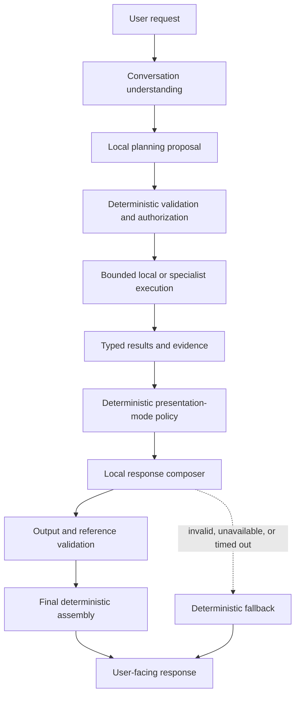

# Elly V3.5 — Mandatory Local Response Composer Plan

**Status:** Implemented; see [IMPLEMENTATION.md](IMPLEMENTATION.md)
**Baseline:** Elly V3  
**Scope:** Requirements, design direction, implementation plan, and acceptance criteria  
**Explicit deferral:** Personality and memory are placeholders only in V3.5

## 1. Purpose

V3 makes local synthesis conditional. A plan may use `DIRECT`, `TEMPLATE`, or
`LOCAL_SYNTHESIS`, and only the last strategy adds a local synthesis step.

V3.5 shall change this model. For normal answer-bearing workflows, a local
response composer shall be the standard final conversational layer. It shall
receive validated outputs from local conversation or specialist execution and
compile them into one useful response for the user.

The intended mental model is:

1. Elly reads and understands the request in conversation context.
2. Elly plans the work and delegates bounded tasks to registered specialists.
3. Specialists return typed results, evidence, uncertainty, and status.
4. Elly's local response composer organizes those results into the final reply.

The composer is mandatory in the nominal answer path, but it is neither an
authority nor a single point of failure. Deterministic application code remains
responsible for authorization, execution status, evidence eligibility,
citations, exact records, and fallback presentation.

## 2. Goals

V3.5 shall:

- Apply a consistent local conversational layer to substantive user-facing
  answers.
- Use that layer for local-only, single-specialist, and multi-specialist
  workflows.
- Keep conversation, planning, and response composition as independently
  configurable local-model roles, even when they initially share one profile.
- Preserve verified facts, citations, uncertainty, disagreement, warnings,
  partial results, and blocked status.
- Prevent the planner or composer from gaining authorization or execution
  authority.
- Preserve exact consent, receipt, status, and protocol records.
- Return a useful deterministic answer if composition fails.
- Establish bounded extension points for future personality and memory without
  implementing either feature in V3.5.

## 3. Non-goals

V3.5 shall not implement:

- Personality training, fine-tuning, adapters, or learned style profiles.
- Persistent personal memory, memory retrieval, memory ranking, or memory
  lifecycle management.
- Automatic training from production conversations.
- Unbounded model-authored factual rewriting.
- Model authority over consent, providers, actions, evidence, citations, task
  status, or retries.
- Transmission of future personal memory to remote specialists.
- Recursive specialist debate or autonomous execution loops.

## 4. Target workflow



For a local-only answer, the local conversation result enters the same response
pipeline as a specialist result. The planner and specialists are not themselves
the final user-facing voice.

## 5. Local-model roles

V3.5 retains three independent logical model roles:

| Role | Responsibility | User-facing authority |
|---|---|---|
| `conversation` | Resolve conversational references and form the contextual request | None |
| `planner` | Propose capabilities, operations, dependencies, and objectives | None |
| `response_composer` | Organize validated results into the normal final reply | Presentation only |

All three roles may bind to the same local-model profile by default. An operator
shall be able to change any role independently through configuration without
source, manifest, or prompt changes.

The existing `synthesis` role shall have a documented migration to
`response_composer`. A temporary compatibility alias may be retained for one
release window. Conflicting old and new bindings shall be rejected or resolved
by an explicit, operator-visible precedence rule.

## 6. Presentation policy

The planner shall no longer decide whether the response composer participates.
Deterministic application policy shall derive a presentation mode from the
validated workflow and result type.

### 6.1 `COMPOSED`

This is the default for ordinary substantive answers, including:

- Local-only conversational answers.
- One-specialist results.
- Multi-specialist results.
- Partial results and disagreements.
- Failed or blocked work that needs a helpful explanation.

The application shall attempt local composition exactly once before presenting
the final response.

### 6.2 `EXACT_WITH_COMPOSED_CONTEXT`

This mode applies when an exact application-owned record must be shown but a
brief conversational explanation is useful. The composer may add clearly
separated framing around the record. It shall not modify the canonical block.

Examples include action receipts, detailed task-status records, and audit-style
results.

### 6.3 `DETERMINISTIC_ONLY`

This mode applies where generated language is inappropriate or where a protocol
requires exact output. Examples include machine-readable output, minimal
consent prompts, and internal protocol responses.

These messages are not considered substantive assistant answers for the
"compose exactly once" requirement.

## 7. Functional requirements

### V3.5-COMP-001 — Standard response-composition stage

Every eligible answer-bearing workflow shall attempt the local response
composer exactly once after result validation and aggregation. Plan shape,
specialist count, or a presentation-ready specialist result shall not bypass
this stage.

### V3.5-COMP-002 — Deterministic presentation-mode ownership

Application policy, not planner output, shall select the presentation mode.
Planner proposals shall not authorize a bypass of composition or select exact
record handling.

### V3.5-COMP-003 — Bounded composition input

The composer shall receive an immutable, size-bounded
`ResponseCompositionInput` containing only approved fields:

- The current user request and approved conversational context.
- Plan and task status.
- Validated local or specialist result summaries.
- Canonical claim, evidence, citation, warning, and disagreement identifiers.
- Partial, failed, blocked, and uncertainty metadata.
- Immutable record references when applicable.
- Response-mode and output-limit metadata.
- A future personality-context placeholder.
- A future memory-context placeholder.

Raw secrets, unapproved provider payloads, hidden reasoning, and unrelated
session data shall not be included.

### V3.5-COMP-004 — Structured, reference-bound output

The composer shall return a typed draft that selects and orders approved result,
claim, citation, warning, and record identifiers. Model-authored prose shall be
bounded to permitted narrative fields and shall not replace canonical facts or
records.

Unknown, duplicated, ineligible, or cross-task references shall invalidate the
draft.

### V3.5-COMP-005 — Immutable authority boundaries

The composer shall not change:

- Whether an action was authorized or executed.
- Task, plan, or step status.
- Consent decisions.
- Exact receipts or audit records.
- Canonical verified claims, values, dates, or citations.
- Evidence classification or verification status.
- Specialist disagreement, warnings, or limitations.

The final deterministic assembler shall insert application-owned content from
validated references.

### V3.5-COMP-006 — Failure isolation and fallback

Composer unavailability, timeout, malformed output, invalid references, or
policy violations shall not convert otherwise usable results into a failed
task. The application shall reject the draft and produce a deterministic
direct/template response that preserves all relevant facts, sources,
uncertainty, and status.

Composition retries shall be bounded and shall not create an open-ended loop.

### V3.5-COMP-007 — Independent configuration

`conversation`, `planner`, and `response_composer` shall resolve independently
configured immutable role settings. Defaults may reuse one named profile.
Status output shall report effective non-secret role configuration.

### V3.5-COMP-008 — Observability

The application shall record:

- Presentation mode.
- Whether composition was attempted, accepted, rejected, or bypassed by policy.
- Composer profile and model version, excluding secrets.
- Referenced result and claim identifiers.
- Validation or fallback reason code.
- Duration and bounded usage metadata.
- Personality and memory context identifiers when those features exist, but not
  their private contents.

Observability shall not record hidden chain-of-thought or unnecessary personal
context.

## 8. Proposed contracts

Illustrative contracts are shown below. Exact names may be frozen during the
implementation phase.

```python
class PresentationMode(str, Enum):
    COMPOSED = "composed"
    EXACT_WITH_COMPOSED_CONTEXT = "exact_with_composed_context"
    DETERMINISTIC_ONLY = "deterministic_only"


@dataclass(frozen=True, slots=True)
class ResponseCompositionInput:
    schema_version: str
    task_id: str
    request_text: str
    presentation_mode: PresentationMode
    task_status: str
    result_refs: tuple[str, ...]
    claim_refs: tuple[str, ...]
    citation_refs: tuple[str, ...]
    warning_refs: tuple[str, ...]
    disagreement_refs: tuple[str, ...]
    immutable_record_refs: tuple[str, ...]
    personality_context: "PersonalityContextPlaceholder | None"
    memory_context: "MemoryContextPlaceholder | None"


@dataclass(frozen=True, slots=True)
class ResponseCompositionDraft:
    schema_version: str
    sections: tuple["ResponseSection", ...]
    referenced_result_ids: tuple[str, ...]
    referenced_claim_ids: tuple[str, ...]
    referenced_citation_ids: tuple[str, ...]
    acknowledged_warning_ids: tuple[str, ...]
    acknowledged_disagreement_ids: tuple[str, ...]
```

The placeholder types shall initially resolve to `None` or empty inert values.
They shall not read storage, change prompts, influence routing, or alter output
in V3.5.

## 9. Personality placeholder

V3.5 reserves a `PersonalityContextPlaceholder` extension point solely to avoid
coupling a future personality feature to composition internals.

For V3.5:

- No personality profile is loaded or persisted.
- No personality-specific prompt mutation is required.
- No training, fine-tuning, preference learning, or feedback collection occurs.
- The placeholder supplies no authority and shall be inert by default.
- Tests shall prove that an empty placeholder does not change factual content,
  status, citations, or authorization behavior.

A future design may use this boundary for tone, verbosity, formatting,
terminology, and other presentation preferences. That future work shall define
its own privacy, precedence, versioning, evaluation, and rollback requirements.

## 10. Memory placeholder

V3.5 reserves a `MemoryContextPlaceholder` extension point for a separately
designed memory subsystem.

For V3.5:

- No personal memory is captured, stored, retrieved, ranked, summarized, or
  transmitted.
- Conversation history continues to use the existing approved context rules;
  it is not reclassified as durable memory.
- The placeholder is empty and inert by default.
- Specialists and providers receive no new personal context.
- Tests shall prove that adding the placeholder does not expand external
  payloads or persistence behavior.

Future memory work shall separately define consent, provenance, sensitivity,
retention, deletion, expiry, correction, retrieval eligibility, and least-
privilege disclosure. Remembered statements shall never become verified
evidence merely because they were stored.

## 11. Security and privacy invariants

- Current user instructions and application safety policy take precedence over
  future stored presentation preferences.
- Composition never authorizes a capability, provider, retry, external
  transmission, or consequential action.
- Composition input is assembled only after normal privacy and evidence
  validation.
- Remote specialists do not receive composer-only context.
- Exact records remain application-owned and immutable.
- Generated prose cannot upgrade inferred, unknown, or unverified information
  to verified fact.
- Cross-task and cross-session identifiers are rejected unless explicitly
  authorized by a future context contract.
- Failure fallback preserves the original epistemic and execution status.

## 12. Implementation plan

### Phase 0 — Contract freeze

- Confirm eligible answer types and deterministic-only exceptions.
- Freeze presentation modes and composition input/output schemas.
- Define migration and compatibility behavior for V3 finalization values and
  the `synthesis` role name.
- Decide whether the composer remains represented as an internal terminal plan
  step or becomes a common post-aggregation application stage. The recommended
  design is a common post-aggregation stage so local-only and specialist paths
  share one final response pipeline.

### Phase 1 — Presentation policy

- Implement deterministic presentation-mode classification.
- Remove planner authority to select or bypass final composition.
- Preserve parsing compatibility for persisted V3 plans during migration.

### Phase 2 — Common response pipeline

- Route local-only, one-specialist, and multi-specialist results through one
  response pipeline.
- Attempt the composer once for `COMPOSED` and according to the frozen rule for
  `EXACT_WITH_COMPOSED_CONTEXT`.
- Retain deterministic-only handling where required.

### Phase 3 — Composer contracts and validation

- Build bounded reference-based inputs.
- Validate structured composer output.
- Assemble canonical factual and exact-record content deterministically.
- Reject unsupported claims, invalid references, status changes, and omitted
  required warnings.

### Phase 4 — Failure handling and observability

- Add bounded timeout and retry behavior.
- Add deterministic fallback for every composition failure mode.
- Record mode, profile, referenced identifiers, outcome, duration, and reason
  codes without private contents.

### Phase 5 — Configuration migration

- Add the `response_composer` role binding.
- Provide the temporary `synthesis` compatibility alias and warning policy.
- Update status reporting, configuration examples, and migration tests.

### Phase 6 — Placeholder boundaries

- Add inert personality and memory placeholder fields or ports.
- Confirm they perform no storage, retrieval, training, prompt mutation, or
  provider transmission.
- Document that their activation requires separate approved requirements and
  design work.

### Phase 7 — End-to-end verification

- Verify local-only, single-specialist, multi-specialist, partial, disagreement,
  blocked, and exact-record workflows.
- Verify deterministic fallback under model timeout, malformed output, invalid
  references, and unavailable local provider.
- Verify configuration independence and migration behavior.
- Verify no expansion of external payloads or persistence from placeholders.

## 13. Acceptance criteria

V3.5 is complete when:

1. Every eligible answer-bearing workflow attempts local composition exactly
   once.
2. Local-only, single-specialist, and multi-specialist results use the same
   final response pipeline.
3. Planner output cannot bypass composition or select exact-record policy.
4. Canonical claims, values, citations, status, warnings, and receipts cannot be
   rewritten by the composer.
5. Partial, blocked, inferred, unknown, and disputed outcomes remain visibly so
   in the final response.
6. Exact records remain byte-for-byte unchanged through presentation.
7. Invalid or unavailable composition falls back to a useful deterministic
   response without changing task success or failure.
8. Conversation, planner, and response-composer roles can be rebound
   independently while sharing a profile by default.
9. V3 `synthesis` configuration and persisted finalization values follow the
   documented migration behavior.
10. Personality and memory placeholders are present but inert, perform no
    persistence or retrieval, and do not expand provider payloads.
11. Unit, contract, integration, restart/recovery, and end-to-end tests cover
    the normal, exceptional, and fallback paths.
12. Documentation and status output consistently use the new response-composer
    terminology.

## 14. Deferred follow-up

Personality and memory require separate future requirements and threat-model
work. Before either placeholder becomes active, the project shall define at
least:

- User consent and controls.
- What may be stored and for how long.
- Inspection, correction, deletion, and export behavior.
- Sensitivity and provenance metadata.
- Retrieval and disclosure rules.
- Separation between remembered context and verified evidence.
- Offline training or adapter governance, dataset review, versioning, rollback,
  and evaluation.
- Protection against personality or memory overriding explicit requests,
  safety rules, authorization, or factual integrity.

These items are intentionally outside V3.5 implementation scope.
