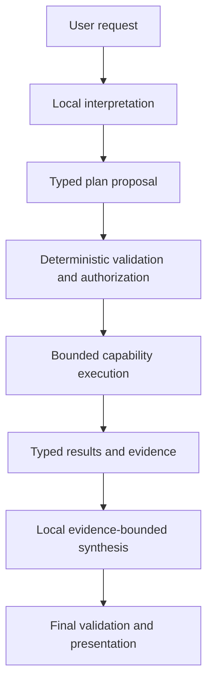
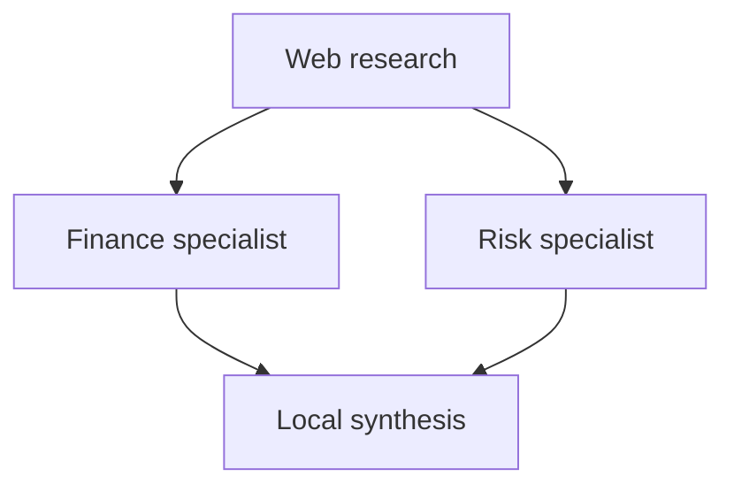

# Elly V3 Requirements: Intelligent Routing, Bounded Multi-Specialist Orchestration, and Local Synthesis

**Status:** Approved
**Baseline:** V2.5 completed and closed 2026-08-15
**Normative requirements:** Thirteen

## 1. Document Purpose

This document defines the proposed requirements for Elly V3’s intelligent model and capability orchestration.

V3 shall allow Elly’s local language model to interpret a user request, propose an appropriate execution plan, use one or more registered specialists when their distinct expertise is needed, and synthesize the validated results into a coherent final response.

The intended outcome is an assistant that can select and combine expertise more intelligently without allowing a language model to bypass deterministic privacy, consent, authorization, availability, execution-limit, or safety controls.

This is an implementation-ready feature requirements document, not a complete replacement for the authoritative Elly SRS. Its identifiers shall be reconciled with the main SRS before implementation begins.

## 2. Confirmed Direction

The following design direction is confirmed for this proposal:

1. Elly shall be designed for multi-specialist execution in V3 rather than hard-coded around exactly one specialist.
2. Initial V3 execution shall remain bounded and policy-controlled.
3. The local LLM may interpret requests, propose plans, and synthesize results.
4. The local LLM shall not independently authorize a capability, provider, external transmission, consequential action, or additional execution step.
5. Elly shall select a capability before selecting a provider-specific model.
6. Every specialist shall have a distinct objective and typed result contract.
7. The final local synthesis step shall preserve evidence, citations, uncertainty, disagreement, warnings, and failure status.
8. Unlimited recursive delegation, open-ended specialist debate, and autonomous execution until the model decides it is finished are not part of the initial V3 scope.
9. Conversation, interpretation/planning, and final synthesis shall be separate
     configurable local-model roles. They may bind to the same profile initially,
     but each role shall be replaceable independently without code or prompt
     changes.

## 3. Terminology

| Term | Meaning |
|---|---|
| Local LLM | Elly’s locally hosted general-purpose model used for private interpretation, local answering, planning proposals, and eligible synthesis. |
| Capability | A provider-independent function registered with Elly, such as web research, financial analysis, coding analysis, image generation, or local synthesis. |
| Specialist | A capability implementation or expert model intended for a particular domain or task. |
| Provider | The concrete local or cloud system used to implement a capability. |
| Execution proposal | An untrusted typed suggestion produced by the local LLM about how a request could be handled. |
| Execution plan | A validated set of steps, dependencies, inputs, outputs, limits, and authorization requirements approved by application policy. |
| Plan step | One bounded unit of work assigned to a registered capability. |
| Synthesis | Composition of validated results into a user-facing response without changing their factual or epistemic meaning. |
| DAG | A directed acyclic graph whose dependency relationships cannot form an execution loop. |
| Replanning | Replacing or revising an approved plan after a defined execution condition, such as an unavailable provider. |
| Evidence-bounded | Restricted to claims supported by approved inputs, specialist results, or eligible evidence supplied to the synthesizer. |
| Local-model profile | A named, reusable validated provider/model/endpoint configuration that one or more local-model roles may reference. |
| Local-model role | One independently configurable use of a local model: conversation, planning, or synthesis. |

## 4. Target Workflow

An approved plan may contain dependencies and parallel branches:

The diagrams describe responsibility flow, not permission flow. Every external or consequential step still requires its own deterministic authorization before execution.

## 5. Functional Requirements

### V3-ROUTE-001 — Local LLM Interpretation and Typed Execution Proposal

#### Problem

Purely deterministic keyword routing is brittle, while directly allowing an LLM to execute whichever model it selects would give probabilistic output inappropriate authority over privacy, consent, availability, and side effects.

#### Requirement

The local LLM shall be permitted to interpret a validated user request and produce a typed execution proposal. The proposal shall be treated as untrusted input and shall not itself authorize or initiate execution.

#### Required proposal fields

The proposal shall contain, at minimum:

- Proposed capability or capabilities.
- Proposed operation for each capability.
- A distinct objective for each proposed step.
- Required and available inputs.
- Expected typed output for each step.
- Dependencies between steps.
- Whether current external information appears necessary.
- Whether external access appears necessary.
- Ambiguities or missing information.
- Proposal confidence or another explicit uncertainty representation.
- A machine-readable reason code and a concise user-independent justification.

#### Required behavior

- The local LLM shall receive only context approved for interpretation.
- Invalid, unknown, unavailable, or malformed proposed capabilities shall be rejected before execution.
- Missing required information shall produce a clarification decision when it cannot be resolved safely from approved context.
- The model’s justification shall support observability but shall not be treated as authorization or exposed as hidden chain-of-thought.
- A proposal may recommend local-only handling, one capability, multiple capabilities, clarification, or inability to proceed.

#### Acceptance criteria

1. The planner produces schema-valid proposals for local-only, one-specialist, research-plus-specialist, and two-specialist examples.
2. Invalid capability identifiers and unsupported operations are rejected deterministically.
3. A proposal cannot directly call a provider or capability.
4. Ambiguous requests can result in a typed clarification proposal.
5. Planner output can be tested with recorded or fake model results without live providers.
6. Changes to the configured provider behind a capability do not require changing the planner’s capability identifier.

---

### V3-ROUTE-002 — Capability-First Selection and Provider Independence

#### Problem

If the planner selects raw models or provider names, application routing becomes coupled to current vendors and model versions. Provider changes would then affect prompts, routing, authorization, and tests throughout the system.

#### Requirement

Elly shall select provider-independent capabilities and operations before resolving a concrete model or provider. Provider resolution shall occur through validated capability configuration after the application approves the step.

#### Required behavior

- A proposal should request `financial_analysis`, `code_review`, or another capability rather than a specific vendor model unless the user explicitly requests and is permitted to use a particular provider.
- Each capability shall define its supported operations, typed inputs, typed outputs, privacy properties, and eligible providers.
- Provider selection shall consider configuration, availability, privacy authorization, consent scope, compatibility, and defined operational limits.
- The local planner shall not bypass the capability registry by naming a provider directly.
- Provider substitution shall not alter the capability’s application-level contract.

#### Acceptance criteria

1. A configured provider can be replaced without modifying orchestration or synthesis logic.
2. A provider name proposed where a capability identifier is required is rejected or normalized through an explicit policy.
3. Capability contract tests run against every configured provider adapter for that capability.
4. Provider-specific response types do not escape into the execution plan or final application result.

---

### V3-CONFIG-001 — Independently Configurable Local-Model Roles

#### Problem

V3 introduces local-model calls for planning and synthesis in addition to
ordinary conversation. Treating all three uses as one inseparable model would
make future role-specific upgrades risky, while duplicating full provider
configuration for every role would make shared changes error-prone.

#### Requirement

Conversation, planning, and synthesis shall be three independent logical model
roles resolved through named, reusable local-model profiles. Initial V3 defaults
may bind all three roles to the existing local Ollama model, but an operator
shall be able to change any one role independently by changing its profile
binding. No role change shall require source, prompt, or manifest edits.

#### Required behavior

- The authoritative configuration shall define named local-model profiles and
   exactly one binding for each required role: `conversation`, `planner`, and
   `synthesis`.
- A profile shall contain one local provider, model identifier, endpoint, and
   default timeout and may be reused by multiple roles.
- Conversation, planner, and synthesizer adapters shall receive their own
   resolved immutable role configuration through composition rather than reading
   configuration independently.
- Role-specific operational limits, such as maximum output tokens, shall remain
   independently configurable even when roles share a profile.
- Initial defaults shall bind all three roles to the existing local Ollama model.
   Shared defaults are configuration reuse, not an architectural coupling.
- Changing the planner binding shall not change conversation or synthesis;
   changing a shared profile shall affect every role intentionally bound to it.
- Environment overrides shall target role bindings or named profiles with
   documented precedence over TOML.
- Existing generalist configuration keys shall have one documented migration
   path. Conflicting old and new keys shall fail validation or follow an explicit
   precedence rule with a safe operator-visible warning; they shall never create
   ambiguous role bindings silently.
- `/status` and the shared application API shall report the effective non-secret
   profile independently resolved for each local-model role.
- Remote research and hosted-specialist model configuration shall remain
   separate and shall not be changed implicitly by any local profile or binding.
- Secrets shall not be stored in the configuration file.

#### Acceptance criteria

1. With the default configuration, conversation, planning, and synthesis bind
     to the same named local profile and existing model.
2. Rebinding only `planner` changes its effective provider/model without
     changing conversation or synthesis.
3. Rebinding conversation or synthesis is equally independent.
4. Updating one shared profile intentionally updates every role bound to it.
5. Role-specific output limits can change without duplicating or changing model
     identity.
6. Invalid, missing, conflicting, unknown, or unsupported profiles/bindings fail
     startup deterministically.
7. Configuration tests cover defaults, TOML, environment precedence, migration,
     and redacted status output.
8. Fake local adapters can be injected independently for deterministic
     conversation, planner, and synthesis tests without changing production
     configuration contracts.
9. Remote provider/model selections remain unchanged when a local profile or
     role binding is changed.

---

### V3-PLAN-001 — Validated DAG Execution Plan

#### Problem

An unrestricted sequence of model-generated steps may contain missing dependencies, incompatible outputs, circular delegation, unreachable steps, or invalid execution order.

#### Requirement

Elly shall convert an accepted proposal into a validated execution plan represented as a directed acyclic graph. No plan step shall begin until the plan-level structural checks and the step’s applicable authorization checks succeed.

#### Required plan fields

Each plan shall contain:

- Stable plan and task identifiers.
- Versioned plan-schema identifier.
- Ordered or dependency-addressable steps.
- Stable step identifier for every step.
- Capability identifier and operation.
- Distinct step objective.
- Typed input references.
- Expected output type.
- Dependency identifiers.
- External-access and side-effect metadata.
- Authorization state.
- Execution state.
- Configured limits and applicable timeout.
- Finalization strategy.

#### Validation rules

Application policy shall verify:

- Every capability is registered and available.
- Every operation is supported.
- Every dependency exists.
- The graph has no cycles.
- Required inputs are available or produced by declared dependencies.
- Producer output types are compatible with consumer input types.
- Step and specialist limits are not exceeded.
- Each specialist has a meaningful and non-duplicative objective.
- Exactly zero or one final local synthesis step exists according to the selected finalization strategy.
- The synthesis step, when present, depends on every result it is expected to use.
- No step can dynamically add an unvalidated step during execution.

#### Acceptance criteria

1. Valid linear and parallel plans pass validation.
2. Plans with direct or indirect cycles are rejected before any capability executes.
3. Missing dependencies, duplicate step identifiers, incompatible types, and unsupported operations are rejected.
4. A plan that exceeds any configured limit is rejected or reduced through an explicit policy before execution.
5. Plan validation requires no live model, database, or network provider.
6. Rejected plans produce actionable reason codes without exposing hidden reasoning.

---

### V3-PLAN-002 — Bounded Multi-Specialist Execution

#### Problem

Multiple specialists can improve cross-domain answers, but unrestricted delegation can cause excessive latency, duplicate work, unpredictable provider usage, privacy expansion, or non-terminating execution.

#### Requirement

V3 shall support bounded execution of multiple specialists when their responsibilities are materially distinct and necessary for the user’s request. All limits shall be centrally configurable and deterministically enforced.

#### Initial recommended defaults

| Limit | Recommended V3 default |
|---|---:|
| Maximum plan steps | 5 |
| Maximum specialist executions | 2 |
| Maximum research executions | 1 |
| Maximum local synthesis executions | 1 |
| Maximum validated replanning attempts | 1 |
| Recursive specialist planning | Disabled |
| Specialist-created specialists | Disabled |
| Execution graph cycles | Prohibited |

These values are recommended defaults, not permanent constants. The authoritative V3 configuration shall define the actual limits.

#### Required behavior

- Limits shall be enforced by application code, not by prompt instructions alone.
- A specialist shall not create or execute another specialist directly.
- A capability result may recommend follow-up work, but that recommendation shall require a new validated plan or permitted replanning attempt.
- Execution shall stop starting new steps after cancellation or when a plan-wide mandatory prerequisite fails.
- Independent approved steps may execute in parallel within existing concurrency and privacy constraints.
- Dependent steps shall not execute until all mandatory dependencies reach an eligible state.
- A plan reaching its limit shall return the appropriate complete, partial, unavailable, or failed result rather than silently exceeding the limit.

#### Acceptance criteria

1. Elly can execute two approved specialists and one synthesis step within the configured limits.
2. A third specialist is rejected when the maximum is two.
3. A specialist cannot recursively invoke itself or another capability outside the plan.
4. Independent steps may execute concurrently, while dependent steps wait.
5. Cancellation prevents new steps from starting and requests cancellation of supported in-progress operations.
6. Execution terminates deterministically for every valid plan.
7. Limit-reached behavior is represented through the established failure taxonomy and audit records.

---

### V3-PLAN-003 — Distinct Specialist Objectives and Redundancy Control

#### Problem

Calling multiple specialists that perform materially identical work increases latency and resource usage without necessarily improving answer quality.

#### Requirement

Every proposed specialist step shall declare a distinct objective, expected contribution, and output type. Elly shall reject or consolidate materially redundant steps unless the user explicitly requests independent verification or a configured policy requires it.

#### Required behavior

- The plan validator shall compare capability, operation, objective, inputs, and expected output when detecting redundancy.
- Different specialists may analyze the same evidence when their perspectives are meaningfully different, such as financial performance and risk analysis.
- Independent verification shall be identified explicitly and shall not be disguised as ordinary multi-specialist execution.
- When verification is requested, synthesis shall preserve whether results agree, disagree, or remain inconclusive.
- Redundancy decisions shall not depend solely on superficial keyword comparison.

#### Acceptance criteria

1. Finance and risk analysis of the same filing are accepted as distinct when their objectives and result types differ.
2. Two identical analysis steps with the same objective and inputs are rejected or consolidated.
3. Explicit independent-verification plans may retain similar steps and label them as verification.
4. Redundancy validation is unit tested without executing specialists.
5. Audit data identifies why multiple similar steps were allowed or consolidated.

---

### V3-EXEC-001 — Per-Step Validation, Privacy, Consent, and Authorization

#### Problem

Approval of an overall plan does not guarantee that every provider, payload, purpose, or consequential action inside it is permitted. Later steps may also receive new derived information that changes their privacy classification.

#### Requirement

Elly shall validate and authorize every plan step immediately before execution using the actual resolved input payload, destination, provider, purpose, capability operation, and action classification.

#### Required behavior

- Plan validation shall not replace execution-time authorization.
- Derived outputs shall be classified before they are passed to another capability or provider.
- Consent shall be verified for the specific provider, capability, purpose, payload scope, and validity period.
- Consequential actions shall use the semantic high-impact action policy defined for Elly.
- A valid authorization for one step shall not automatically authorize another step.
- A denied step shall not transmit its input payload.
- A blocked optional branch may permit a `PARTIAL` plan result; a blocked mandatory step shall prevent dependent execution.
- Authorization decisions shall be recorded without logging prohibited payloads.

#### Acceptance criteria

1. A plan approved structurally cannot execute a cloud step with expired or mismatched consent.
2. Data produced by one specialist is reclassified before transmission to another provider.
3. Consent for one provider does not authorize another provider.
4. A blocked step does not call its provider.
5. Dependencies of a blocked mandatory step do not execute incorrectly.
6. Local-only steps remain available when policy permits an honest local fallback.
7. Authorization behavior is consistent across CLI, web, desktop/mobile, and API interfaces.

---

### V3-EXEC-002 — Typed Specialist Results and Result Validation

#### Problem

Free-form specialist text does not reliably preserve claims, evidence, uncertainty, warnings, execution status, or machine-readable outputs needed for safe synthesis.

#### Requirement

Every specialist execution shall return a typed, versioned result that is validated before it becomes eligible for downstream use or synthesis.

#### Required result fields

A specialist result shall contain, as applicable:

- Plan, task, and step identifiers.
- Capability and operation identifiers.
- Completion status.
- Summary.
- Structured claims or findings.
- Evidence and claim-to-evidence references.
- Assumptions.
- Uncertainties and epistemic status.
- Warnings and limitations.
- Structured domain output.
- Recommended presentation structure, if useful.
- Provider and retrieval provenance permitted for audit.
- Usage and timing metadata permitted by policy.
- Error details translated into provider-independent types.

#### Required behavior

- Malformed results shall not be supplied to synthesis as valid results.
- Provider-specific objects and exceptions shall be normalized at the adapter boundary.
- Results shall distinguish absent evidence from evidence that contradicts a claim.
- A result shall not claim successful external action without a verified execution receipt.
- Result status shall use Elly’s established failure taxonomy consistently.

#### Acceptance criteria

1. Contract tests validate every specialist implementation against its result schema.
2. Missing mandatory fields produce `FAILED` or `PARTIAL` according to documented policy, not silent success.
3. Claims can be traced to their eligible evidence records.
4. Provider exceptions do not reach the synthesizer or user interface directly.
5. An action result without a valid receipt cannot be represented as completed.
6. Older supported result-schema versions are migrated or rejected with an actionable compatibility status.

---

### V3-SYN-001 — Evidence-Bounded Local Final Synthesis

#### Problem

Specialist results may be technically correct but fragmented, inconsistent in style, overly technical, or disconnected from the user’s original request and approved context. A finalizer can improve clarity, but it could also invent facts or alter the meaning of specialist results.

#### Requirement

Elly shall support a local synthesis step that composes approved, validated results into a coherent final response. The synthesizer shall be evidence-bounded and shall improve organization, clarity, relevance, and Elly’s presentation style without changing the factual or epistemic meaning of its inputs.

#### Approved synthesis inputs

The local synthesizer may receive only:

- The validated user request.
- Approved conversation and profile context.
- The validated execution-plan summary.
- Eligible typed specialist results.
- Eligible evidence and citations.
- Step statuses, uncertainties, disagreements, limitations, and warnings.
- Output-format and presentation instructions.

#### Required synthesis rules

The synthesizer shall not:

- Introduce unsupported factual claims.
- Remove material qualifications or warnings.
- Convert `UNKNOWN`, `PARTIAL`, `FAILED`, `BLOCKED`, `UNAVAILABLE`, or `CANCELLED` into successful completion.
- Invent evidence, citations, actions, receipts, or specialist agreement.
- Present conflicting findings as consensus.
- Claim an external action occurred unless supported by a verified receipt.
- Reveal private intermediate content not approved for presentation.
- Execute tools, specialists, or external providers.

The synthesizer shall preserve claim-to-evidence relationships and provide a clear account of material disagreement.

#### Acceptance criteria

1. A multi-specialist result is converted into one coherent response while preserving every material warning and limitation.
2. Unsupported claims introduced by a test synthesizer output are detected or prevented before presentation.
3. Citations remain attached to the claims they support.
4. A `PARTIAL` plan remains visibly partial in the final result.
5. Conflicting specialist conclusions remain explicitly identified.
6. The synthesis step cannot call a capability or provider.
7. Synthesis uses the local model by default and does not transmit additional information externally.
8. Output validation can reject a malformed or status-inconsistent synthesized response.

---

### V3-SYN-002 — Conditional Synthesis and Deterministic Fallback

#### Problem

Not every capability result benefits from generative rewriting. Rewriting exact records, action receipts, consent prompts, or already presentation-ready output may increase latency or reduce accuracy. The local model may also be unavailable or fail during synthesis.

#### Requirement

Elly shall select a documented finalization strategy for each approved plan. Local generative synthesis shall be used only when it adds defined value and shall have a deterministic fallback.

#### Supported finalization strategies

V3 shall support at least:

- `DIRECT`: present a validated capability result through deterministic formatting.
- `LOCAL_SYNTHESIS`: use the local LLM to compose one or more validated analytical results.
- `TEMPLATE`: render exact structured data, receipts, consent prompts, or errors without generative rewriting.

#### Required behavior

- Multi-specialist analytical plans should normally use local synthesis.
- Exact action receipts, task statuses, consent decisions, and audit-style records shall use deterministic presentation unless a specific approved summary is also requested.
- A single presentation-ready specialist result may bypass synthesis.
- If local synthesis is unavailable or fails, Elly shall use the safest applicable direct or template representation of validated results.
- Fallback shall preserve status, evidence, warnings, and limitations.
- Synthesis failure shall be observable and shall not cause completed specialist work to be lost.

#### Acceptance criteria

1. An exact calendar or action receipt is presented without creative rewriting.
2. Two analytical specialist results are eligible for local synthesis.
3. A presentation-ready single result can use direct formatting.
4. Local synthesizer failure produces a readable deterministic fallback containing the validated results and correct status.
5. Fallback never presents malformed or unauthorized content.
6. The selected finalization strategy is recorded with the plan.

---

### V3-RES-001 — Partial Failure, Disagreement, and Status Preservation

#### Problem

A multi-step plan may produce a mixture of successful, failed, blocked, unavailable, cancelled, or conflicting results. Treating the plan as simply successful or failed would discard useful work or misrepresent completeness.

#### Requirement

Elly shall aggregate step outcomes into a typed plan result that preserves completed work, failures, blocked branches, unavailable capabilities, cancellation, disagreement, and uncertainty.

#### Required behavior

- Each step shall retain its own status.
- The plan shall identify completed, skipped, blocked, failed, unavailable, and cancelled steps.
- Plan-level status shall be derived deterministically from step criticality and outcomes.
- Valid results from completed steps may remain eligible for a `PARTIAL` response.
- A failed optional branch shall not be described as completed.
- A failed mandatory prerequisite shall prevent dependent execution.
- Specialist disagreements shall be represented explicitly rather than resolved solely by model preference.
- The synthesizer shall receive the derived plan status and shall not alter it.

#### Acceptance criteria

1. When one of two optional specialists fails, Elly can return a `PARTIAL` answer using the successful result and naming the missing analysis.
2. When a mandatory research step fails, dependent analysis does not run with missing evidence.
3. Conflicting specialist findings appear as disagreement in the plan and final response.
4. Cancellation cannot be presented as successful completion.
5. Plan-status derivation is covered by a decision table and unit tests.
6. Valid evidence already collected before cancellation is retained only according to the approved cancellation and privacy policy.

---

### V3-REPLAN-001 — Single Bounded Replanning Attempt

#### Problem

A provider or capability may become unavailable after plan approval. No replanning may make recoverable workflows unnecessarily fail, while unlimited replanning can cause loops, unexpected external calls, or resource exhaustion.

#### Requirement

V3 may perform at most one deterministic-policy-approved replanning attempt for a task by default. The revised proposal shall pass the same structural, compatibility, privacy, consent, action, and execution-limit validation as the original plan.

#### Permitted replanning triggers

Replanning may be considered when:

- A selected capability or provider becomes unavailable.
- A recoverable step returns insufficient but valid information.
- A typed input becomes unavailable because an optional dependency failed.
- A permitted provider substitution is available.

Replanning shall not be used to bypass denied authorization, denied consent, a user cancellation, or a plan-wide hard limit.

#### Required behavior

- The revised plan shall retain provenance linking it to the original plan.
- Previously completed valid steps shall not be repeated unless idempotency and policy explicitly allow it.
- Replanning shall not broaden the payload, provider set, purpose, or side effects without new authorization.
- A second replanning request shall terminate with the appropriate partial, unavailable, blocked, or failed result.
- The user may disable automatic replanning through configuration when supported.

#### Acceptance criteria

1. An unavailable provider can be replaced once by an approved provider that implements the same capability contract.
2. Denied consent cannot trigger a plan that attempts the same transmission through another provider.
3. Completed external actions are not duplicated during replanning.
4. A second replanning attempt is rejected.
5. Replanning history is visible through safe task provenance.
6. Cancellation prevents replanning.

---

### V3-OBS-001 — Plan and Result Provenance Without Hidden Reasoning

#### Problem

Multi-step orchestration is difficult to debug or trust if users and engineers cannot determine which capabilities ran, which evidence contributed, and where failures occurred. At the same time, observability must not expose hidden reasoning or sensitive intermediate payloads.

#### Requirement

Elly shall record safe, structured provenance for execution proposals, approved plans, step transitions, capability results, replanning, synthesis, and final status without storing or exposing hidden chain-of-thought or prohibited sensitive content.

#### Required provenance

Provenance shall include, as permitted:

- Task, plan, and step identifiers.
- Capability and operation identifiers.
- Provider identifier where authorized for audit.
- Plan-schema and result-schema versions.
- Dependency relationships.
- Step start, completion, and cancellation timestamps.
- Authorization decision identifiers and reason codes.
- Result and evidence identifiers.
- Replanning lineage.
- Finalization strategy.
- Plan and step statuses.
- Safe usage and latency measurements.

#### Acceptance criteria

1. A trace can show which capabilities contributed to a final response.
2. A trace identifies failed, blocked, skipped, and cancelled steps.
3. Every synthesized claim can be associated with eligible evidence or a specialist result when required by evidence policy.
4. Traces do not expose credentials, tokens, full private prompts, hidden chain-of-thought, prohibited provider bodies, or consent-protected payloads.
5. Replanned tasks show original and replacement plan identifiers.
6. Trace behavior is consistent across every supported interface through the shared application API.

## 6. Cross-Cutting Requirements

### 6.1 Deterministic authority boundary

Language models may interpret, propose, summarize, and synthesize. Deterministic application policy shall retain authority over:

- Capability registration and availability.
- Plan validity.
- Execution limits.
- Privacy classification requirements.
- External-transmission authorization.
- Consent validity and scope.
- Consequential actions.
- Provider eligibility.
- Cancellation.
- Idempotency and retry eligibility.
- Status derivation.
- Whether a result is eligible for synthesis or presentation.

### 6.2 Cancellation

Cancellation shall:

- Prevent new steps from starting.
- Request cancellation of supported in-progress operations.
- Prevent replanning.
- Mark unstarted dependent steps appropriately.
- Preserve only eligible completed evidence and results.
- Prevent partial output from being presented as a complete answer.

### 6.3 Idempotency

Retries and replanning shall not unintentionally duplicate:

- Provider requests.
- Specialist executions.
- Stored results.
- Evidence records.
- Audit events.
- Consequential external actions.

If an external provider cannot guarantee idempotency, Elly shall record that duplicate execution may have occurred and shall not falsely claim certainty.

### 6.4 Privacy minimization

Each step shall receive only the minimum approved information required for its objective. A multi-step plan shall not automatically expose the entire conversation or all previous specialist results to every capability.

### 6.5 Interface neutrality

CLI, web, desktop/mobile, and API interfaces shall submit requests through the same application API and receive the same validated orchestration behavior for equivalent user and session context. Interfaces shall not implement independent planning, routing, authorization, or synthesis policy.

### 6.6 Configuration validation

Startup validation shall reject:

- Invalid or non-positive execution limits.
- Missing, conflicting, unknown, or unsupported local-model profiles or role
   bindings.
- Duplicate capability identifiers.
- Unsupported plan-schema versions.
- Capabilities without valid typed contracts.
- Synthesis enabled without an eligible local model or deterministic fallback.
- Replanning configurations that exceed the system maximum.
- Provider configurations inconsistent with capability privacy requirements.

## 7. Required Test Strategy

### 7.1 Unit tests

Unit tests shall cover:

- Proposal-schema validation.
- Capability-first resolution.
- DAG validation and cycle detection.
- Dependency and type compatibility.
- Limit enforcement.
- Redundancy detection.
- Plan-status derivation.
- Finalization-strategy selection.
- Synthesis output validation.
- Replanning eligibility.
- Privacy and authorization decisions.

### 7.2 Contract tests

Contract tests shall cover:

- Planner proposal output.
- Every capability input and result schema.
- Provider normalization.
- Local synthesis input and output.
- Application API plan and trace representations.
- Compatibility across supported schema versions.

### 7.3 Integration tests

Integration tests shall cover:

- Local-only handling.
- One specialist followed by synthesis.
- Research followed by one specialist and synthesis.
- Research feeding two parallel specialists followed by synthesis.
- One optional specialist failure producing a partial response.
- Mandatory dependency failure preventing downstream execution.
- Specialist disagreement.
- Per-step consent enforcement.
- Cancellation during parallel execution.
- One successful and one rejected replanning attempt.
- Local synthesis failure with deterministic fallback.
- Restart or recovery during a persisted plan where supported.

### 7.4 Adversarial and edge-case tests

The V3 suite shall include:

- Planner proposes an unregistered capability.
- Planner proposes a provider instead of a capability.
- Direct and indirect dependency cycles.
- Duplicate and materially redundant specialists.
- Malformed specialist output.
- Specialist output containing unsupported claims.
- Synthesizer removes a warning or changes status.
- Synthesizer invents a citation or action receipt.
- Consent valid for the wrong provider or purpose.
- Private derived result proposed for an unauthorized provider.
- Cancellation immediately before a new step begins.
- Provider timeout after an uncertain external action outcome.
- Replanning that would duplicate an already completed action.
- Execution limit reached with some valid results.

## 8. Recommended Implementation Sequence

1. Define versioned proposal, plan, step, result, and synthesis contracts.
2. Introduce named local-model profiles and independent role bindings, then
     migrate conversation to the `conversation` role.
3. Implement deterministic plan validation and DAG cycle detection.
4. Implement persisted plan and step state with safe provenance.
5. Implement bounded execution with dependency scheduling and cancellation.
6. Add per-step privacy, consent, and action authorization.
7. Migrate one existing specialist to the typed plan-step contract.
8. Add local evidence-bounded synthesis and deterministic fallback.
9. Add a second specialist and parallel execution.
10. Add redundancy control, disagreement aggregation, and partial-status derivation.
11. Add one bounded replanning attempt.
12. Complete integration, migration, live-provider, and adversarial verification.

## 9. V3 Completion Criteria

V3 orchestration is complete when:

1. The local LLM can propose typed local, single-specialist, and bounded multi-specialist plans.
2. Deterministic code validates and authorizes every plan and step.
3. Elly can execute at least two distinct specialists within configurable limits.
4. Valid plans are acyclic and terminate deterministically.
5. Capability selection remains provider independent.
6. Every specialist returns a validated typed result.
7. The local model can synthesize multiple results without changing evidence, uncertainty, disagreement, warnings, or status.
8. Exact and presentation-ready results can bypass generative synthesis.
9. Local synthesis failure produces a safe deterministic fallback.
10. Partial failure and disagreement are represented honestly.
11. At most one validated replanning attempt is permitted by default.
12. Cancellation and idempotency protections cover the complete plan.
13. Safe provenance identifies contributing capabilities and evidence without exposing hidden reasoning or sensitive payloads.
14. Conversation, planning, and synthesis resolve through independent
      configurable local-model roles, while initial defaults may reuse one profile.
15. The required unit, contract, integration, adversarial, migration, and
      limited live-verification tests pass.

## 10. Explicit V3 Non-Goals

The initial V3 release shall not provide:

- Unlimited specialist executions.
- Recursive specialist delegation.
- Specialists that independently create or authorize other specialists.
- Open-ended debate among agents.
- Repeated self-reflection until a model decides the answer is good enough.
- Unlimited or model-controlled replanning.
- Execution plans with cycles.
- Model authority over privacy, consent, provider authorization, consequential actions, or execution limits.
- Automatic transmission of the full conversation to every specialist.
- A guarantee that multiple specialists always produce a better answer.
- A marketplace for untrusted third-party capabilities.

These behaviors may be considered in a later version only after V3 provides evidence that bounded orchestration is reliable, useful, observable, and safe.

## 11. Deferred Future Direction

A later V3.x or V4 may evaluate:

- More than two specialists.
- User-configurable orchestration profiles.
- Multiple rounds of specialist critique.
- More advanced plan repair.
- Explicit independent verification modes.
- Adaptive resource limits based on task class.
- Additional local planner or synthesizer models.
- Carefully sandboxed specialist-to-specialist collaboration.

Any such expansion shall retain deterministic authorization, bounded termination, typed contracts, safe provenance, and honest status reporting.