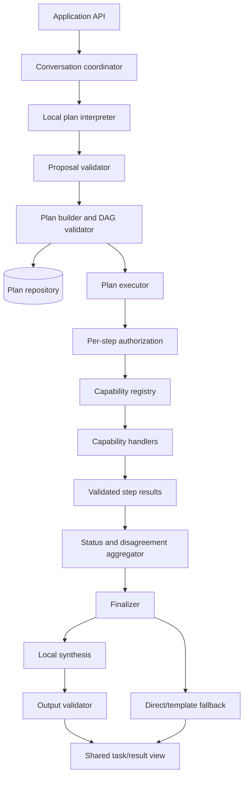

# Elly V3 Technical Design — Bounded Planning and Local Synthesis

**Status:** Approved
**Baseline:** Closed V2.5 registry-driven routing
**Requirements:** [REQUIREMENTS.md](REQUIREMENTS.md)

## 1. Purpose

V3 adds model-assisted interpretation, validated DAG plans, bounded
multi-capability execution, and evidence-bounded local synthesis without moving
authority out of deterministic application code. It extends the V2.5 registry;
it does not create a second routing system.

The local model may propose and arrange work. Only application policy may
validate a plan, authorize a step, resolve a provider, derive status, or decide
what is eligible for presentation.

## 2. Requirements analysis

The requirements define thirteen normative areas: two routing requirements,
one configuration requirement, three planning requirements, two execution
requirements, two synthesis requirements, result aggregation, replanning, and
observability.

The following design decisions resolve important ambiguities:

1. **V2.5 remains the selection foundation.** The planner sees the immutable
  routing catalog and proposes capability/operation IDs. Every proposal is
  revalidated against a fresh registry snapshot.
2. **Structural validation and execution authorization are separate.** The
  complete graph is validated before execution. Privacy, consent, provider,
  cost, and action authorization are repeated immediately before each step
  using its resolved payload.
3. **Synthesis is a terminal internal step.** A `LOCAL_SYNTHESIS` plan contains
  exactly one terminal local-synthesis step. `DIRECT` and `TEMPLATE` plans
  contain none.
4. **Parallelism is dependency-driven and bounded.** Only ready steps may run;
  global and per-kind semaphores impose configured ceilings.
5. **Redundancy uses typed intent metadata.** Deterministic comparison uses
  capability, operation, objective class, perspective, input references, and
  result type. Free-text similarity alone never authorizes duplicate work.
6. **Independent verification is narrow.** Initial V3 permits a user-requested
  `verification=true` marker for otherwise similar independent steps. It does
  not implement debate, repeated critique, or autonomous verification rounds.
7. **Planner failure has a safe fallback.** If local planning is unavailable or
  malformed, Elly may use the existing deterministic V2.5 catalog decision for
  local or single-capability work. It shall not invent a multi-step plan.
8. **Synthesis cannot freely rewrite factual claims.** The model proposes an
  outline, claim references, ordering, and bounded connective text. The final
  renderer inserts canonical validated claim text and citations. Invalid
  references or status changes cause deterministic fallback.
9. **Recovery is conservative.** A persisted `RUNNING` external step is not
  automatically reissued after restart. It becomes `INTERRUPTED` or
  `POSSIBLE_DUPLICATE` according to its operation record and requires the
  existing retry/idempotency policy.
10. **Local model roles are independently replaceable.** Conversation,
  planning, and synthesis resolve separate role bindings. Initial defaults
  reuse one profile, while any role can later bind to another profile.

## 3. Architecture



`ConversationOrchestrator` remains responsible for request/session context and
handoff. A new `PlanOrchestrator` owns plan lifecycle. A `PlanExecutor` owns
dependency scheduling. This prevents V3 from expanding the existing
conversation coordinator into a plan scheduler.

## 4. Independent local-model roles

### 4.1 Authoritative configuration

V3 uses a catalog of named reusable local-model profiles plus three explicit
role bindings:

```toml
[local_models.profiles.qwen_default]
provider = "ollama"
model_id = "qwen3:8b"
base_url = "http://127.0.0.1:11434"
timeout_seconds = 120

[local_models.roles]
conversation = "qwen_default"
planner = "qwen_default"
synthesis = "qwen_default"

[local_models.role_limits]
conversation_max_output_tokens = 512
planner_max_output_tokens = 1200
synthesis_max_output_tokens = 1600
```

The defaults preserve today's behavior by pointing all roles at `qwen_default`.
To upgrade planning independently, an operator adds another profile and changes
only `local_models.roles.planner`:

```toml
[local_models.profiles.planner_large]
provider = "ollama"
model_id = "qwen3:14b"
base_url = "http://127.0.0.1:11434"
timeout_seconds = 180

[local_models.roles]
conversation = "qwen_default"
planner = "planner_large"
synthesis = "qwen_default"
```

Updating `qwen_default` intentionally updates every role still bound to it.
Hosted research and specialist choices remain under `[providers]`, `[models]`,
and `[models.specialists]`.

Resolution order is:

1. conservative built-in defaults;
2. `config.local.toml` or an explicitly selected TOML file; and
3. `ELLY_LOCAL_CONVERSATION_PROFILE`, `ELLY_LOCAL_PLANNER_PROFILE`, and
  `ELLY_LOCAL_SYNTHESIS_PROFILE` role-binding environment overrides.

`Config` exposes an immutable profile catalog and three resolved
`LocalModelRoleConfig` values. The composition root constructs or reuses
transports as appropriate, then injects independent conversation, planner, and
synthesis ports. Application services never read environment variables or TOML
directly. Sharing a transport or profile is an optimization, not a type-level
coupling between roles.

### 4.2 Migration

During one documented migration window, old `models.generalist`,
`providers.generalist`, and `[generalist]` connection keys may populate a
generated `v2_generalist` profile and bind all three roles to it only when no V3
profiles or role bindings are supplied. If old and new values conflict, the V3
catalog wins and startup emits one redacted deprecation warning. V3 services
resolve identity only through their role binding. A later version may remove
old-key parsing.

The status view reports, per role, profile name, provider, model ID, and endpoint
host, but never credentials or secret query values.

## 5. Core contracts

All identifiers use the existing bounded safe-ID validation. All collections
are immutable after validation. Model-facing DTOs have explicit schema versions
and strict unknown-field rejection.

### 5.1 Proposal

```python
@dataclass(frozen=True, slots=True)
class ExecutionProposal:
  schema_version: str
  disposition: ProposalDisposition
  steps: tuple[ProposedStep, ...]
  finalization: FinalizationStrategy
  ambiguities: tuple[ClarificationField, ...]
  confidence: float
  reason_code: str

@dataclass(frozen=True, slots=True)
class ProposedStep:
  proposal_step_id: str
  capability_id: str
  operation_id: str
  objective: str
  objective_class: str
  perspective: str
  inputs: tuple[ProposedInput, ...]
  dependencies: tuple[str, ...]
  expected_output_type: str
  required: bool
  verification: bool = False
```

The model does not propose provider IDs, consent decisions, cost, final
authorization state, executable handlers, or arbitrary prompt bodies.

### 5.2 Validated plan

```python
@dataclass(frozen=True, slots=True)
class ExecutionPlan:
  plan_id: str
  task_id: str
  schema_version: str
  revision: int
  parent_plan_id: str | None
  steps: tuple[PlanStep, ...]
  finalization: FinalizationStrategy
  limits: PlanLimitsSnapshot
  catalog_version: str

@dataclass(frozen=True, slots=True)
class PlanStep:
  step_id: str
  kind: StepKind
  capability_id: str
  operation_id: str
  objective: str
  objective_class: str
  perspective: str
  inputs: tuple[InputBinding, ...]
  dependencies: tuple[str, ...]
  output_type: str
  criticality: StepCriticality
  verification: bool
  timeout_seconds: float
```

`PlanLimitsSnapshot` records the validated limits used for this revision so a
running task cannot acquire broader authority after configuration reload.
Every DAG node, including research and local synthesis, counts toward
`max_plan_steps`. Research, hosted specialist, and local-synthesis execution
also have their own counters; all remote calls count toward the existing global
provider-call and budget ceilings.

### 5.3 Typed step result

`CapabilityExecution` is adapted to return a `StepResultEnvelope` containing
schema version, plan/task/step identity, capability/operation identity, status,
canonical findings, claims, claim supports, warnings, assumptions,
uncertainties, structured domain output, provenance, usage, and safe failures.
Provider-native types and exceptions stop at adapters.

Each capability descriptor declares accepted input types and output-schema
versions. Plan type checking is based on these declared contracts, not Python
class-name strings supplied by a model.

### 5.4 Synthesis contract

The local model receives a bounded `SynthesisInput` containing approved context,
plan status, canonical claim IDs/text, citation IDs, warnings, disagreements,
and step summaries. It returns a `SynthesisDraft`:

```python
@dataclass(frozen=True, slots=True)
class SynthesisDraft:
  schema_version: str
  status: PlanStatus
  sections: tuple[SynthesisSection, ...]
  included_warning_ids: tuple[str, ...]
  included_disagreement_ids: tuple[str, ...]
```

Sections may select canonical claims and presentation-safe summaries. The model
cannot create claim or citation records. The deterministic renderer verifies
all references, inserts canonical claim text and citations, checks mandatory
warnings/disagreements, and rejects status elevation.

## 6. Planner pipeline

1. Validate and normalize the user request.
2. Build approved bounded conversation/profile context.
3. Take an immutable registry catalog snapshot.
4. Minimize the catalog into model-safe routing metadata.
5. Call `LocalPlannerPort` using the resolved `planner` role configuration.
6. Parse strict structured output with size and item ceilings.
7. Reject provider names, unknown IDs, unsupported operations, unknown fields,
  invalid dependencies, and unsafe rationale payloads.
8. Revalidate against a fresh registry snapshot.
9. Produce clarification, local handling, a validated plan candidate, or a
  deterministic single-route fallback.

Planner justification is reduced to an allowlisted reason code plus a short
bounded diagnostic. Free-form hidden reasoning is neither requested nor stored.

## 7. Plan validation

Validation is pure and provider-free. It performs, in order:

1. schema and identifier validation;
2. catalog existence and availability checks;
3. operation, input, output, freshness, and action-effect compatibility;
4. duplicate step and dependency checks;
5. topological sort and cycle rejection;
6. input-producer/output-consumer type compatibility;
7. objective distinctness and redundancy checks;
8. finalization and terminal synthesis checks; and
9. configured plan, specialist, research, synthesis, replan, timeout, and cost
  reservation ceilings.

The validator returns either an immutable `ExecutionPlan` or typed rejection
codes. It never mutates a proposal to make unsafe work valid. A separately
defined reduction policy may remove optional redundant steps, but the reduced
plan is validated again and its change is visible in provenance.

## 8. Redundancy control

Each operation contract gains `objective_classes`, `perspectives`, and
`output_type`. A deterministic fingerprint includes:

```text
(capability, operation, objective_class, perspective,
 normalized input references, output_type)
```

Equal fingerprints are redundant. Related fingerprints are permitted only when
their declared perspectives or output contracts are distinct. Similar steps
with `verification=true` require an explicit user request captured in validated
request metadata. The model cannot set that authority by itself.

## 9. Execution scheduler

The scheduler maintains a persisted state machine:

```text
PENDING -> READY -> AUTHORIZING -> RUNNING
RUNNING -> COMPLETED | PARTIAL | FAILED | BLOCKED | UNAVAILABLE | CANCELLED
PENDING/READY -> SKIPPED | BLOCKED | CANCELLED
```

For each scheduling cycle it:

1. observes cancellation;
2. derives ready steps whose mandatory dependencies are eligible;
3. marks descendants of failed mandatory dependencies `SKIPPED`;
4. acquires global and capability-kind concurrency permits;
5. resolves input references and minimizes the payload;
6. reclassifies actual resolved input;
7. resolves a configured provider;
8. performs consent, cloud, cost, action, and capability authorization;
9. atomically records the operation lease and transition to `RUNNING`;
10. invokes the registered handler; and
11. validates and persists the normalized result before releasing dependants.

The scheduler never invokes a handler obtained from model output; it resolves
the validated capability ID from the live registry immediately before dispatch.

## 10. Status aggregation

Step status is immutable history plus a current state. Plan status is derived,
not generated. The minimum decision table is:

| Condition | Plan status |
|---|---|
| Cancellation accepted | `CANCELLED` |
| Required step blocked | `BLOCKED` |
| Required step failed with no eligible result | `FAILED` |
| Required capability unavailable | `UNAVAILABLE` |
| All required steps complete; optional step failed/skipped | `PARTIAL` |
| Eligible results materially disagree | `PARTIAL` with disagreement |
| All required steps and finalization complete | `COMPLETED` |

The implementation shall specify precedence for simultaneous terminal events
in a pure `PlanStatusPolicy`; cancellation observed before final commit wins.
Valid completed work can appear in partial or cancelled views only when privacy
and presentation policy permits it.

## 11. Finalization

`FinalizationPolicy` chooses exactly one strategy before execution:

- `DIRECT`: one validated presentation-ready analytical result;
- `TEMPLATE`: statuses, receipts, consent, exact records, and errors; or
- `LOCAL_SYNTHESIS`: multiple eligible analytical results or one result that
 explicitly requires composition.

Synthesis uses the resolved `synthesis` role configuration. It has no capability
registry, provider resolver, tools, or execution callback.
Any parse error, unknown reference, missing mandatory warning, invented
citation, disagreement loss, or status elevation causes deterministic direct or
template fallback. Completed specialist results are never discarded because
finalization failed.

## 12. Replanning

At most one revised plan (`revision == 1`) may be created. `ReplanPolicy`
checks the typed trigger, cancellation, prior attempts, completed operations,
payload/provider/purpose expansion, remaining limits, and idempotency state.

A replacement provider implementing the same capability contract does not need
a new model proposal, but still needs execution-time authorization. A changed
capability, objective, dependency, or payload requires a revised proposal and
full validation. Denied consent, denied authorization, cancellation, hard-limit
exhaustion, and uncertain consequential action outcomes are never replan
triggers.

## 13. Persistence and recovery

Schema migration 7 adds normalized tables rather than embedding executable
plans in opaque JSON:

- `execution_plans` — plan identity, revision, parent, schema/catalog version,
 finalization, status, limit snapshot, timestamps;
- `plan_steps` — typed identity, objective metadata, criticality, state,
 capability/operation, output type, timeout;
- `plan_dependencies` — validated graph edges;
- `step_results` — normalized result envelope and retention flags;
- `step_claims` and `step_claim_supports` — evidence lineage;
- `plan_events` — bounded state-transition provenance; and
- `synthesis_results` — strategy, validation state, referenced result IDs, and
 retained presentation output.

Input bodies and private results follow session retention/no-store policy.
Operational rows keep hashes, safe IDs, states, timestamps, and reason codes.
Migration is additive and idempotent; existing V2.5 tasks remain readable and
need no synthetic plans.

On startup, nonterminal plans are reconciled. Unstarted steps remain resumable;
local read-only steps may be retried under policy; uncertain external operations
are not automatically repeated. Recovery emits safe audit events.

## 14. Authorization and security

The plan is descriptive, not authoritative. Existing cloud authorization,
consent, action authorization, cost ledger, guardrails, operation leases,
cancellation, and capability preparation remain mandatory.

Additional V3 rules:

- minimize context separately for every step;
- classify derived results before reuse;
- bind consent to plan/step, capability, provider, purpose, payload hash, cost
 ceiling, and expiry;
- never pass one provider's native result object to another capability;
- never log proposal prompts, chain-of-thought, raw private payloads, or provider
 bodies; and
- treat manifests, planner output, specialist output, and synthesis output as
 untrusted input.

## 15. Public API and observability

The shared application API gains additive plan views:

- `PlanView`: plan/revision/status/finalization and bounded step summaries;
- `PlanStepView`: safe capability, operation, dependencies, state, reason code,
 timestamps, and usage;
- `PlanTraceView`: state transitions, authorization IDs, replanning lineage, and
 contributing result/evidence IDs; and
- `LocalModelRoleView`: effective non-secret profile identity for each role.

CLI, web, desktop/mobile, and REST adapters render these views and do not own
planning policy. `/status` reports all local role bindings and orchestration limits.
`/task` and `/trace` may display plan/step summaries without payload bodies.

## 16. Configuration

Recommended initial limits:

```toml
[limits]
# V3 acceptance includes one research call plus two hosted specialist calls.
max_provider_calls = 3
# Two independent ready steps may run concurrently.
max_concurrency = 2

[orchestration]
max_plan_steps = 5
max_specialist_executions = 2
max_research_executions = 1
max_synthesis_executions = 1
max_replans = 1
max_parallel_steps = 2
recursive_planning = false
specialist_delegation = false
automatic_replanning = true
```

The existing global timeout, provider-call, concurrency, queue, budget, and cost
limits remain upper bounds. V3 limits may narrow but never expand those limits
silently. Startup rejects contradictions such as orchestration parallelism above
global concurrency, synthesis without a valid synthesis-role binding and fallback, or
replanning above the compiled maximum of one.

This is an intentional V3 default migration from V2.5's two provider calls and
single concurrency slot. Operators may configure lower limits, but `/status`
must then report that the full multi-specialist acceptance profile is disabled.

## 17. Failure model

New internal reason codes include:

```text
PROPOSAL_MALFORMED
PROPOSAL_CAPABILITY_UNKNOWN
PROVIDER_IDENTIFIER_NOT_ALLOWED
PLAN_CYCLE
PLAN_DEPENDENCY_MISSING
PLAN_TYPE_MISMATCH
PLAN_LIMIT_EXCEEDED
PLAN_REDUNDANT_STEP
STEP_AUTHORIZATION_DENIED
STEP_DEPENDENCY_FAILED
STEP_RESULT_MALFORMED
SYNTHESIS_REFERENCE_INVALID
SYNTHESIS_STATUS_MISMATCH
REPLAN_NOT_ELIGIBLE
REPLAN_LIMIT_REACHED
RECOVERY_EXTERNAL_OUTCOME_UNCERTAIN
```

Provider-specific errors remain translated into the established failure
taxonomy. Public diagnostics expose safe codes and next actions, not internals.

## 18. Principal risks and mitigations

| Risk | Mitigation |
|---|---|
| Model proposal gains authority | Fresh catalog validation and just-in-time authorization |
| DAG executor becomes another monolith | Separate planner, validator, scheduler, aggregator, and finalizer |
| Parallel steps leak excess context | Per-step input binding, minimization, and reclassification |
| Duplicate external work | Durable operation leases and conservative recovery |
| Redundant specialist cost | Typed objective fingerprint and configured ceilings |
| Synthesizer invents claims | Canonical claim references and deterministic rendering/fallback |
| Model-role configuration becomes coupled | Named reusable profiles plus three validated role bindings |
| Historical tasks break | Additive schema; V2.5 tasks remain planless and readable |

## 19. Definition of done

V3 is ready for owner acceptance only when all thirteen requirements have
traceable tests, migrations are verified from representative schema-v6 data,
the complete deterministic suite and static quality gates pass, and limited
live local planner/synthesizer plus hosted capability verification is recorded
honestly. Live verification may be explicitly accepted as a bounded exception;
it must never be inferred from fakes.